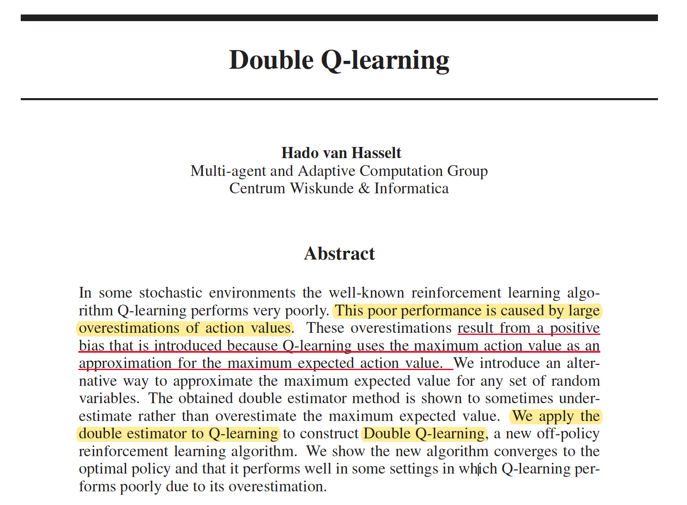
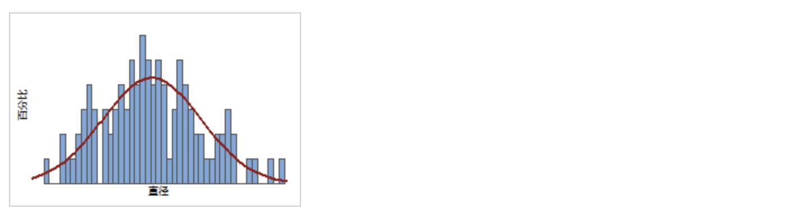
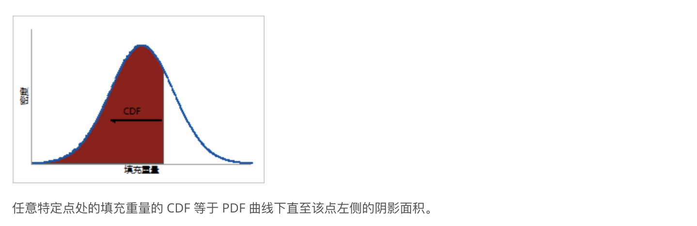
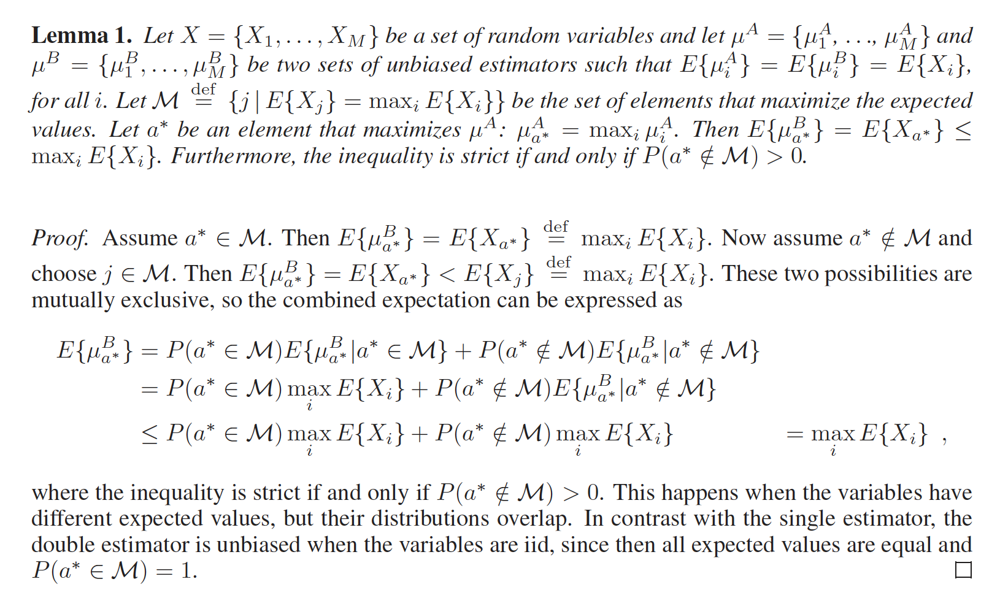
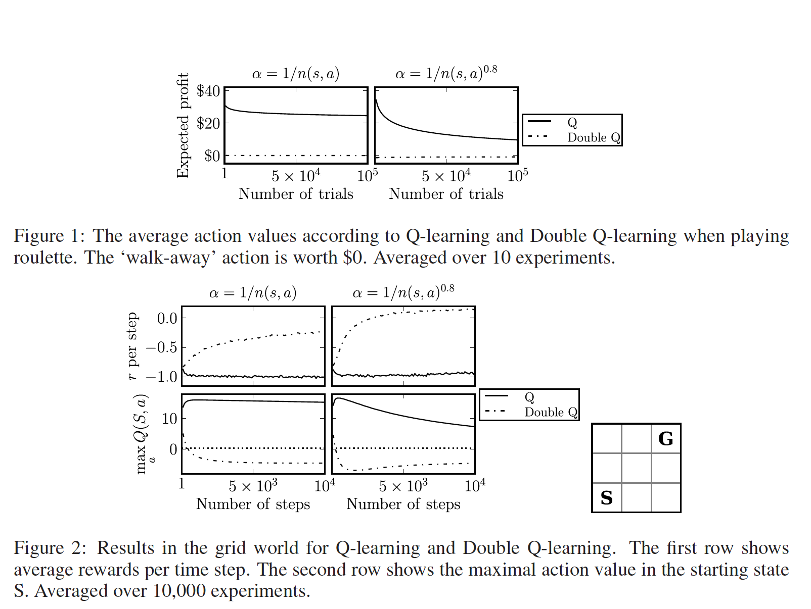
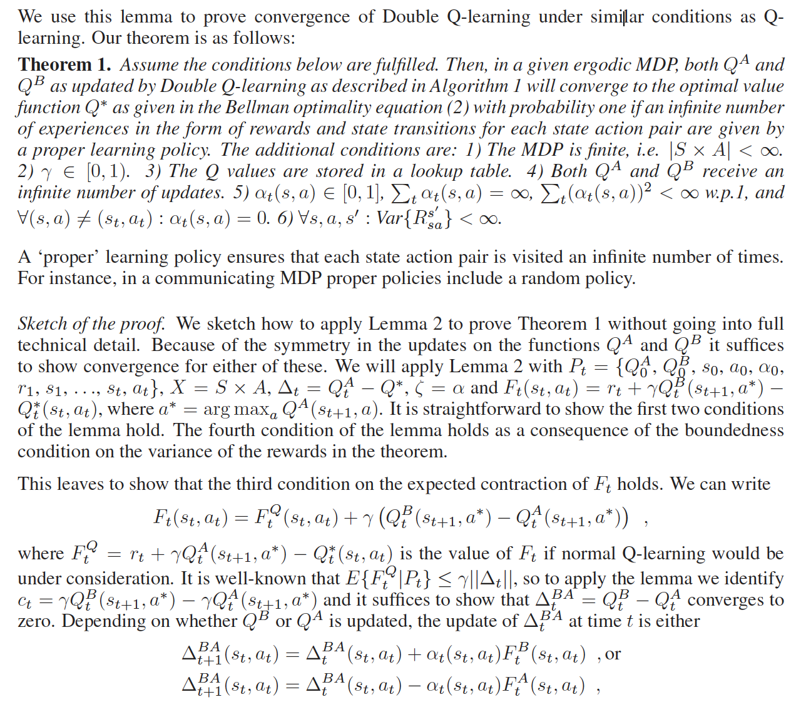
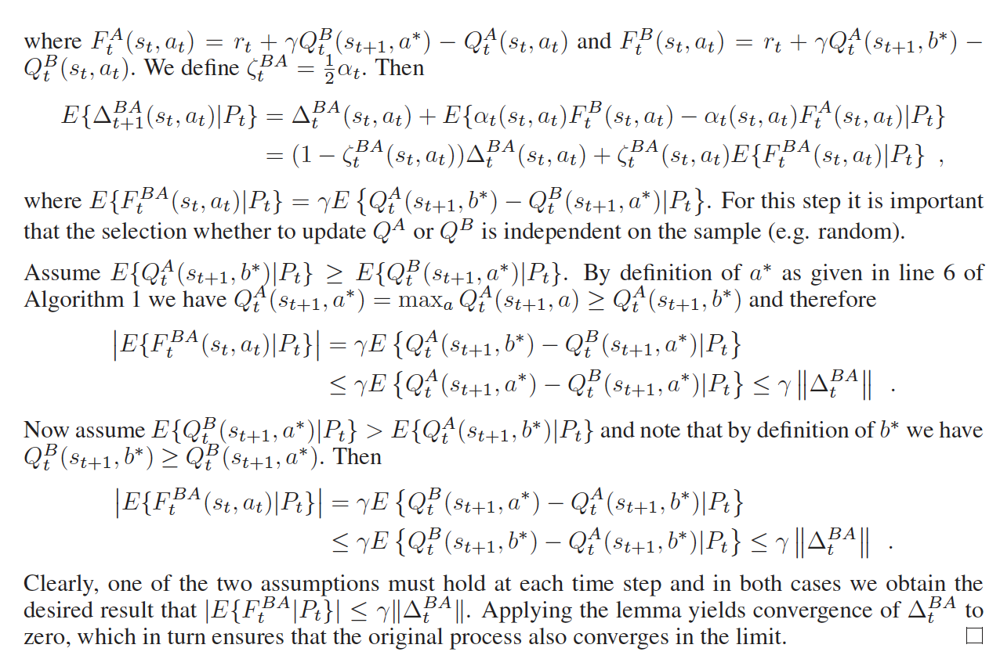

论文地址： https://papers.nips.cc/paper/3964-double-q-learning.pdf

本论文是由DeepMind发表于2015年NIPS的一篇论文，作者Hasselt。

>前言： Q-Learning算法由于受到大规模的动作值过估计(overestimation)而出现不稳定和效果不佳等现象的存在，而导致overestimation的主要原因来自于最大化值函数(max)逼近，该过程目标是为了最大的累计期望奖励，而在这个过程中产生了正向偏差。而本文章作者巧妙的是使用了两个估计器(double estimator)去计算Q-learning的值函数，作者将这种方法定义了一个名字叫“Double Q-learning”（本质上一个off-policy算法），并对其收敛过程进行了证明(缺点：当然double Q-learning算法有时会低估动作值，但不会像Q学习那样遭受过高估计）

## 1. 问题及原因
> "**过估计**" (overestimate)
>
> 过估计是指*对一系列数先求最大值再求平均，通常比先求平均再求最大值要大（或相等*，数学表达为：$E(\max (X1, X2, ...)) \geq \max (E(X1), E(X2), ...)$ 

一般来说Q-learning方法导致overestimation的原因归结于其更新过程，其表达为：
$$
Q_{t+1}\left(s_{t}, a_{t}\right)=Q_{t}\left(s_{t}, a_{t}\right)+\alpha_{t}\left(s_{t}, a_{t}\right)\left(r_{t}+\gamma \max _{a} Q_{t}\left(s_{t+1}, a\right)-Q_{t}\left(s_{t}, a_{t}\right)\right)
$$

其中的 $\max\limits_{a}$ 表示为最大化action-value, 而更新最优化过程如下：
$$
\forall s, a: Q^{*}(s, a)=\sum_{s^{\prime}} P_{s a}^{s^{\prime}}\left(R_{s a}^{s^{\prime}}+\gamma \max _{a} Q^{*}\left(s^{\prime}, a\right)\right)
$$

对于任意的$s, a$ 来说，最优值函数 $Q^{*}$ 的更新依赖于 $\max \limits_{a} Q^{*}(s,...)$, 从公式中可以看出，我们把N个Q值先通过取max操作之后，然后求平均(期望)，会比我们先算出N个Q值取了期望之后再max要大。这就是overestimate的原因。

> 注： 一般用于加速Q-learning算法的方法有：Delayed Q-learning, Phased Q-learning, Fitted Q-iteration等

## 2. Estimator原理与思想
通常情况下对于一个集合中的变量 $X= \left\{ X_{1},X_{2},...,X_{M} \right\}$来说，奖励的最大化累计期望表示为：
$$
  \max \limits_{a} E \left\{ X_{i} \right\}
$$

那么在实际的过程中，对于每个 $X_{i}$，我们定义 $ S=\bigcup_{i=1}^{M} S_{i}$为采样，其中的 $S_{i}$ 表示为对于所有$X_{i}$采样的一个子集，假设 $S_{i}$ 满足独立同分布情况， 那么期望值的“无偏估计”可以通过计算每个变量的样本平均值来获得，其计算方法如下：
$$
E\left\{X_{i}\right\}=E\left\{\mu_{i}\right\} \approx \mu_{i}(S) \stackrel{\text { def }}{=} \frac{1}{\left|S_{i}\right|} \sum_{S \in S_{i}} s
$$

>注： $\mu_{i}$ 是 $X_{i}$ 的估计器

这个过程是一个无偏估计，因为每一个采样 $s\in S_{i}$是一个对 $X_{i}$ 的无偏估计，因此，近似中的误差仅由估计中的 **“方差“** 组成，当我们获得更多样本时会减小。

为了后面方便理解，这里我们定义两个函数：“**概率密度函数”**(Probability Density Function, PDF)和“**累积分布函数**”(Cumulative Distribution Function, CDF)，概率密度函数$f_{i}$表示$i^{th}$个 $X_{i}$，则累积分布函数表示为： $F_{i}(x)= \int_{-\infty}^{x} f_{i}(x)dx$，同样的道理，对于PDF和CDF来说估计器分别表示为$f_{i}^{\mu}$和$F_{i}^{\mu}$。
>**补充**
> **1. 概率密度函数**， 
> 其实就是给定一个值, 判断这个值在该正态分布中所在的位置后, 获得其他数据高于该值或低于该值的比例，其中的曲线就是概率密度函数(PDF)，通常情况下pdf的曲线下面积(AUC)总和为1，且曲线末端不会接触到x轴(换句话说, 我们不可能100%的确定某件事)。
> 
>
>**2. 累积分布函数**
> 累积分布函数 (CDF) 计算给定 x 值的累积概率。可使用 CDF 确定取自总体的随机观测值将小于或等于特定值的概率。还可以使用此信息来确定观测值将大于特定值或介于两个值之间的概率。
>
>例如，罐装苏打水的填充重量服从正态分布，且均值为 12 盎司，标准差为 0.25 盎司。概率密度函数 (PDF) 描述了填充重量的可能值的可能性。CDF 提供每个 x 值的累积概率。
>*此处参考[PDF-CDF指导](https://support.minitab.com/zh-cn/minitab/18/help-and-how-to/probability-distributions-and-random-data/supporting-topics/basics/using-the-probability-density-function-pdf/)*

#### （1）单估计器方法（Single Estimator）
>所谓的单估计就是使用一组估计量的最大值作为近似值，

即近似$\max \limits_{a} E \left\{ X_{i} \right\}$的最好的方式就是最大化估计器,表示为：
$$
\max _{i} E\left\{X_{i}\right\}=\max _{i} E\left\{\mu_{i}\right\} \approx \max _{i} \mu_{i}(S)
$$

$\mu$表示为估计器，而此处对于最大的估计器$f_{max}^{\mu}$来说，它是依赖于 $f_{i}^{\mu}$ 的，若要求取PDF，首先需要考虑CDF，但它的概率分布中最大的估计器小于等于$x$，这等同于所有的估计均小于等于$x$，数学表示为：
$$
x: F_{\max }^{\mu}(x) \stackrel{\text { def }}{=} P\left(\max _{i} \mu_{i} \leq x\right)=\prod_{i=1}^{M} P\left(\mu_{i} \leq x\right) \stackrel{\text { def }}{=} \prod_{i=1}^{M} F_{i}^{\mu}(x)
$$

 那么$\max_{i}\mu_{i}(S)$是对$E\left\{\max _{j} \mu_{j}\right\}=\int_{-\infty}^{\infty} x f_{\max }^{\mu}(x)dx$的无偏估计，详细表示为：
$$
E\left\{\max _{j} \mu_{j}\right\}=\int_{-\infty}^{\infty} x \frac{d}{d x} \prod_{i=1}^{M} F_{i}^{\mu}(x) d x=\sum_{j}^{M} \int_{-\infty}^{\infty} x f_{j}^{\mu}(s) \prod_{i \neq j}^{M} F_{i}^{\mu}(x) d x
$$

#### （2）双估计器方法（Double Estimator）
>对每个变量使用两个估计器，并将估计器的选择与其值解耦。

**问题**：单一估计器方法导致过高估计可能会对使用此方法的算法（例如Q学习）产生很大的负面影响。为了解决这个问题，double estimator方法用来解决过高估计。

那么对于原来的 $\max_{i} E \left\{ X_{i} \right\}$来说，此处我们需要定义两个估计器：$\mu^{A}$和$\mu^{B}$，他们分别表示为：$\mu^{A}=\left\{\mu_{1}^{A}, \ldots, \mu_{M}^{A}\right\}$，$\mu^{B}=\left\{\mu_{1}^{B}, \ldots, \mu_{M}^{B}\right\}$，然后两个估计器都使用采样的样本子集来更新，其规则表示为:
$$ \left\{
\begin{aligned}
S=S^{A} \cup S^{B} \\
S^{A} \cap S^{B}=\emptyset \\
\mu_{i}^{A}(S)=\frac{1}{\left|S_{i}^{A}\right|} \sum_{s \in S_{i}^{A}} s \\
\mu_{i}^{B}(S)=\frac{1}{\left|S_{i}^{B}\right|} \sum_{s \in S_{i}^{B}} s
\end{aligned}
\right.
$$

那么像单估计器$\mu_{i}$一样，如果我们假设样本以适当的方式（例如随机地）分布在两组估计器上，则$\mu_{i}^{A}$和$\mu_{i}^{B}$也都是无偏的。设 $\operatorname{Max}^{A}(S) \stackrel{\text { def }}{=}\left\{j | \mu_{j}^{A}(S)=\max _{i} \mu_{i}^{A}(S)\right\}$ 为$\mu^{A}(S)$ 中最大估计值集合，由于$\mu^{B}$是一个独立的无偏估计值，那么 $E\left\{\mu_{j}^{B}\right\}=E\left\{X_{j}\right\}$对于任何$j$都成立，包括 $j \in Max^{A}$
> 此处有疑问，为什么包括$j \in Max^{A}$？？

设$a^{*}$ 是最大化 $\mu^{A}$ 的估计器，表示为：$\mu^{A}: \mu_{a^{*}}^{A}(S) \stackrel{\text { def }}{=} \max _{i} \mu_{i}^{A}(S)$，如果存在多个最大化的$\mu^{A}$ 是最大化估计量，我们可以例如随机选择一个，然后我们可以将$\mu_{a^{*}}^{A}$用作$\max _{i} E\left\{\mu_{i}^{B}\right\}$的估计值，那么对于$\max_{i}E\left\{X_{i}\right\}$可以近似为：
$$
\max _{i} E\left\{X_{i}\right\}=\max _{i} E\left\{\mu_{i}^{B}\right\} \approx \mu_{a^{*}}^{B}
$$

随着我们获得更多的样本，估计量的方差减小，在极限情况下，$\mu_{i}^{A}(S)=\mu_{i}^{B}(S)=E\left\{X_{i}\right\}$

> 具体证明过程部分如下：

## 3. Double Q-learning算法
我们可以解释为 Q-learning学习其实使用单估计器(single estimate)去估计下一个状态：那么$\max _{a} Q_{t}\left(s_{t+1}, a\right)$是 $E\left\{\max _{a} Q_{t}\left(s_{t+1}, a\right)\right\}$的一个估计，一般的，将期望理解为对同一实验的所有可能运行的平均，而不是（通常在强化学习环境中使用）对下一个状态的期望，根据原理部分，Double Q-learning将使用两个函数 $Q^{A}$和$Q^{B}$（对应两个估计器），并且每个$Q$函数都会使用另一个$Q$函数的值更新下一个状态。两个$Q$函数都必须从不同的经验集中学习，这一点很重要，但是要选择要执行的动作可以同时使用两个值函数。 因此，该算法的数据效率不低于Q学习。 在实验中作者为每个动作计算了两个Q值的平均值，然后对所得的平均Q值进行了贪婪探索。**算法伪代码如下**：
.png)

为了区分Double Q-learning算法和Q-learning的区别，本文同样Q-learning算法伪代码贴出来了。

> 对比：此处对于Q-learning算法和double Q-learning 算法来说，double使用了B网络来更新A网络，同样的道理对于B网络则使用A网络的值来更新。

## 4. 实验过程于结果

## 5. 附录：收敛性证明过程
对于Double Q-learning收敛性的证明过程如下：

