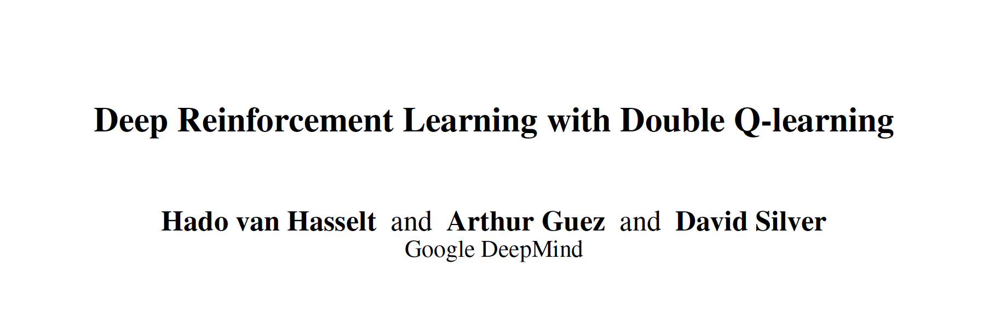

论文地址： https://arxiv.org/pdf/1509.06461.pdf
> 本文是Google DeepMind于2015年12月提出的一篇解决Q值"过估计(overestimate)"的文章，作者Hado van Hasselt在其2010年发表的[Double Q-learning](https://blog.csdn.net/gsww404/article/details/103413124)算法工作的基础上结合了DQN的思想，提出了本文的state-of-the-art的Double DQN算法。给出了过估计的通用原因解释和解决方法的数学证明，最后在Atari游戏上有超高的分数实验表现。

正常论文的阅读方式，先看摘要和结论：
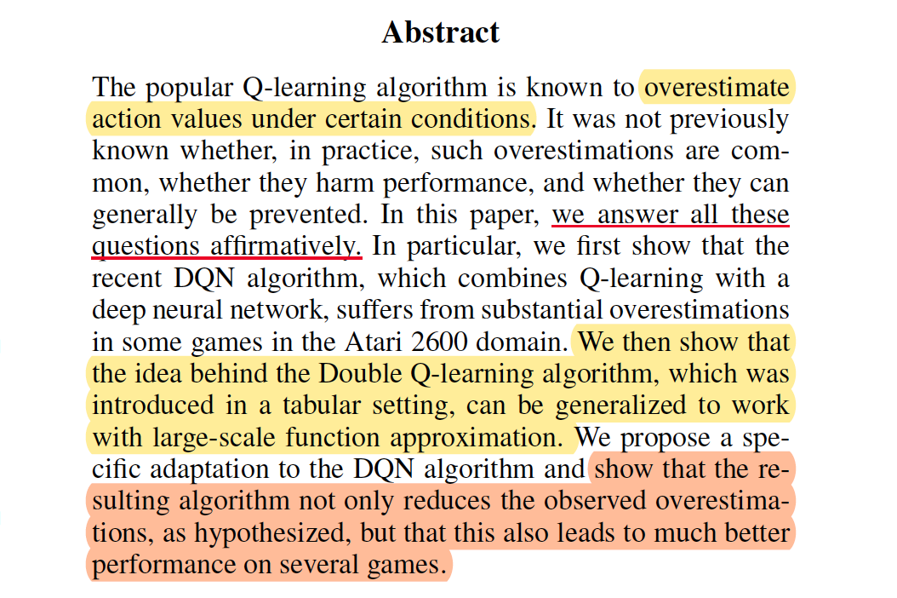
通常情况下，在Q-learning学习中“过估计”是经常发生的，并且影响实验的性能，作者提出了一种可以回答这个问题，并在Double Q-learning算法的基础上进行function approximation的方法，结果表明不仅可以减少观察值的过估计，而且在许多游戏上还有更好的性能表现。而结论部分如下：
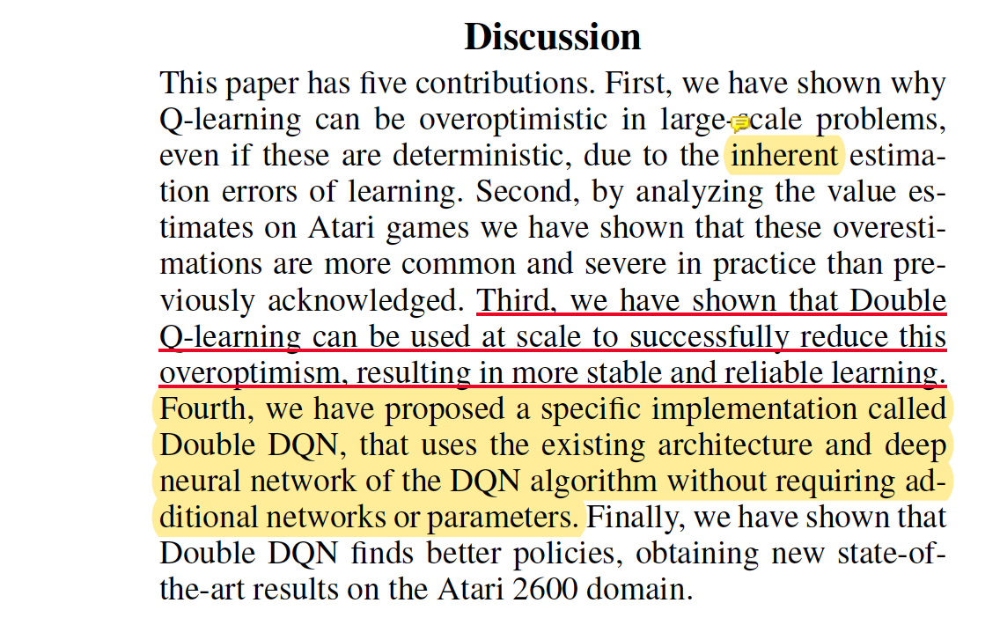

作者将整个文章的贡献总结了五点：前三点基本上说了过估计问题的存在，重要性和Double Q-learning算法能解决这个问题，**本文重点是第四**，作者提出了一种在Double Q-learning基础上**利用“DQN”算法网络结构**的方法“Double DQN”,并在第五点获得state-of-the-art的效果，下面详细介绍。

### 1. 问题阐述

#### 1.1 过估计问题现象
[Q-learning](https://blog.csdn.net/gsww404/article/details/103566859)算法在低维状态下的成功以及DQN和target DQN的效果已经很好了，但是人们发现了一个问题就是之前的Q-learning、DQN算法都会过高估计(overestimate)Q值。开始大家都将其原因归结于函数逼近和噪音。
+ **Q-learning**拿到状态对应的所有动作Q值之后是直接选取Q值最大的那个动作，这会导致更加倾向于估计的值比真实的值要高。为了能够使得标准的Q-learning学习去大规模的问题，将其参数化Q值函数表示为：
$$
\theta_{t+1}=\boldsymbol{\theta}_{t}+\alpha\left(Y_{t}^{\mathrm{Q}}-Q\left(S_{t}, A_{t} ; \boldsymbol{\theta}_{t}\right)\right) \nabla_{\boldsymbol{\theta}_{t}} Q\left(S_{t}, A_{t} ; \boldsymbol{\theta}_{t}\right)
$$
其中 $Y_{t}^{\mathrm{Q}}$表示为：
$$
Y_{t}^{\mathrm{Q}} \equiv R_{t+1}+\gamma \max _{a} Q\left(S_{t+1}, a ; \boldsymbol{\theta}_{t}\right)
$$
其实我们发现这个更新过程和梯度下降大同小异，此处均以更新参数 $\theta$ 进行学习。
+ **DQN**算法非常重要的两个元素是“经验回放”和“目标网络”，通常情况下，DQN算法更新是利用目标网络的参数 $\theta^{-}$,它每个$\tau$ 步更新一次，其数学表示为：
$$
Y_{t}^{\mathrm{DQN}} \equiv R_{t+1}+\gamma \max _{a} Q\left(S_{t+1}, a ; \boldsymbol{\theta}_{t}^{-}\right)
$$
上述的标准的Q-learning学习和DQN中均使用了 $\max$ 操作，使得选择和评估一个动作值都会过高估计，为了解决这个问题，Double Q-learning率先使用了两个值函数进行解耦，其互相随机的更新两个值函数，并利用彼此的经验去更新网络权重$\theta$和$\theta^{-}$, 为了能够明显的对比，

+ **Double Q-learning**，2010年本文作者Hasselt就针对过高估计Q值的问题提出了[*Double Q-learning*](https://blog.csdn.net/gsww404/article/details/103413124)，他就是尝试通过将选择动作和评估动作分割开来避免过高估计的问题。在原始的Double Q-Learning算法里面，有两个价值函数(value function)，一个用来选择动作（当前状态的策略），一个用来评估当前状态的价值。这两个价值函数的参数分别记做 $\theta$ 和 $\theta^{'}$ 。算法的思路如下：

$$
Y_{t}^{\mathrm{Q}}=R_{t+1}+\gamma Q\left(S_{t+1}, \underset{a}{\operatorname{argmax}} Q\left(S_{t+1}, a ; \boldsymbol{\theta}_{t}\right) ; \boldsymbol{\theta}_{t}\right)
$$
通过对原始的Q-learning算法的改进，Double Q-learning的误差表示为：
$$
Y_{t}^{\text {DoubleQ }} \equiv R_{t+1}+\gamma Q\left(S_{t+1}, \underset{a}{\operatorname{argmax}} Q\left(S_{t+1}, a ; \boldsymbol{\theta}_{t}\right) ; \boldsymbol{\theta}_{t}^{\prime}\right)
$$
此处意味着我们仍然使用贪心策略去学习估计Q值，而使用第二组权重参数$\theta^{'}$去评估其策略。
#### 1.2 估计误差: “过估计”
##### 1.2.1 上界估计
Thrun等人在1993年的时候就给出如果动作值包含在区间 $[-\epsilon, \epsilon]$ 之间的标准分布下的随机的误差，那么上限估计为： $\gamma \epsilon \frac{m-1}{m+1}$ (m表示动作的数量)
##### 1.2.2 下界估计
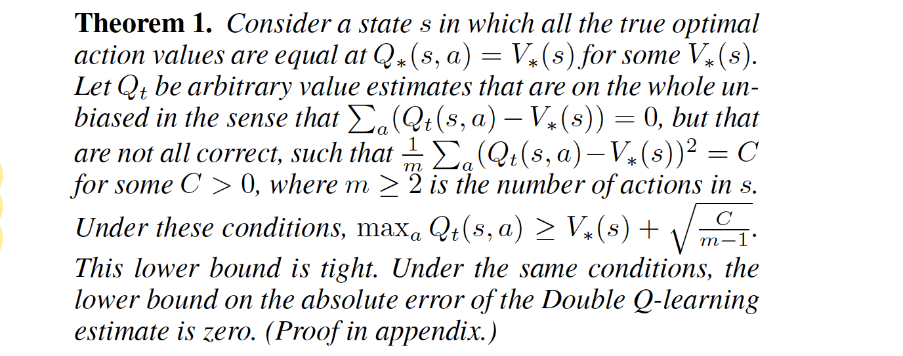
作者给出了一个定理1：
> 在一个状态下如果动作 $m>2$且 $C=\frac{1}{m} \sum_{a}\left(Q_{t}(s, a)-V_{*}(s)\right)^{2}>0$，则
【1】$\max _{a} Q_{t}(s, a) \geq V_{*}(s)+\sqrt{\frac{C}{m-1}}$ 
【2】Double Q-learning的下界绝对误差为0

根据定理1我们得到下界估计的值随着 $m$ 的增大而减小，通过实验，下面结果表明 $m$对估计的影响，图中明显表明，Q-learning的随m的增大越来越大，而Double Q-learning是**无偏估计**，并未随着m增大而过度变化，基本上在0附近。
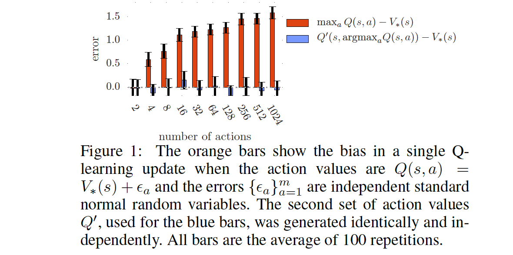

>附录：定理1证明过程
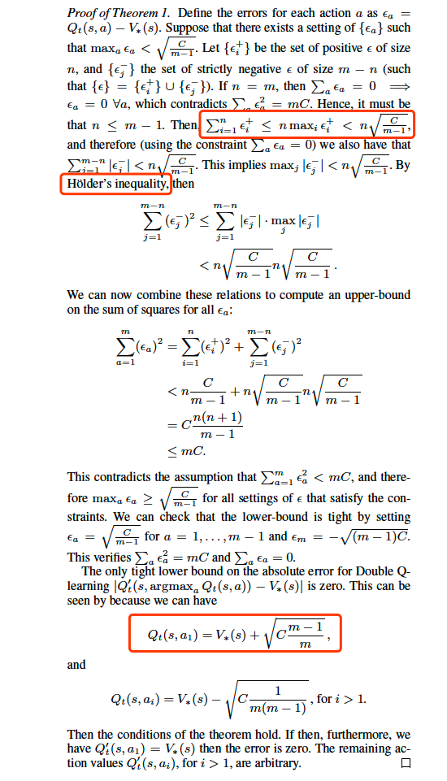

**此处作者还得出一个定理结论**
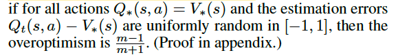
> 证明如下：
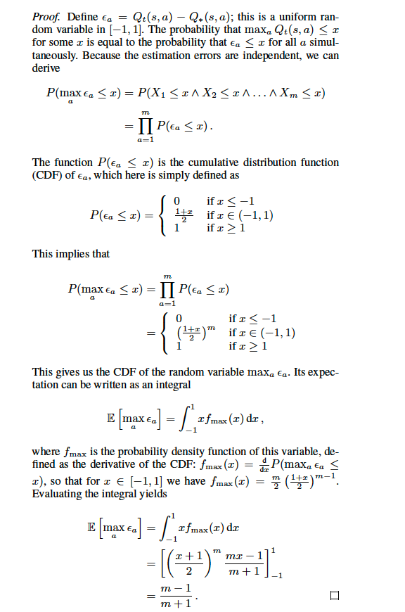


**为了进一步说明Q-learning, Double Q-learning估值偏差的区别，作者给出了一个有真实$Q$值的环境：假设$Q$值为 $Q_(s, a) = sin(s)以及Q_(s, a) = 2 exp(-s^2)$ ，然后尝试用6阶和9阶多项式拟合这两条曲线，一共进行了三组实验，参见下面表格**
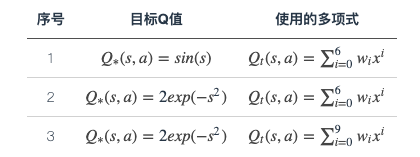


这个试验中设定有10个action（分别记做 a1,a2,…,a10 ），并且Q值只与state有关。所以对于每个state，每个action都应该有相同的true value，他们的值可以通过目标Q值那一栏的公式计算出来。此外这个实作还有一个人为的设定是每个action都有两个相邻的state不采样，比如说 a1 不采样-5和-4（这里把-4和-5看作是state的编号）， a2 不采样-4和-3等。这样我们可以整理出一张参与采样的action与对应state的表格：
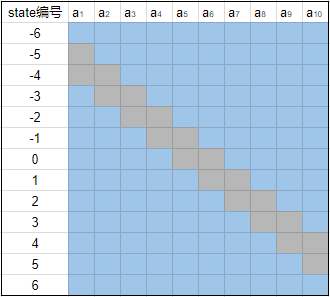
浅蓝色代表对应的格子有学习得到的估值，灰色代表这部分不采样，也没有对应的估值（类似于监督学习这部分没有对应的标记，所以无法学习到东西）

这样实验过后得到的结果用下图展示：


从这里面可以看出很多事情：

+ 最左边三幅图（对应 action2 那一列学到的估值）中紫色的线代表真实值（也就是目标Q值，通过s不同取值计算得出），绿色的线是通过Q-learning学习后得到的估值，其中绿点标记的是采样点，也就是说是通过这几个点的真实值进行学习的。结果显示前面两组的估值不准确，原因是我们有十一个值（ s∈−6,−5,−2,−1,0,1,2,3,4,5,6 ），用6阶多项式没有办法完美拟合这些点。对于第三组实验，虽然能看出在采样的这十一个点中，我们的多项式拟合已经足够准确了，但是对于其他没有采样的点我们的误差甚至比六阶多项式对应的点还要大。
+ 中间的三张图画出了这十个动作学到的估值曲线（对应图中绿色的线条），并且用黑色虚线标记了这十根线中每个位置的最大值。结果可以发现这根黑色虚线几乎在所有的位置都比真实值要高。
+ 右边的三幅图显示了中间图中黑色虚线和左边图中紫线的差值，并且将Double Q-Learning实作的结果用同样的方式进行比较，结果发现Double Q-Learning的方式实作的结果更加接近0。这证明了Double Q-learnign确实能降低Q-Learning中过高估计的问题。
+ 前面提到过有人认为过高估计的一个原因是不够灵活的value function，但是从这个实验结果中可以看出，虽然说**在采样的点上，value function越灵活，Q值越接近于真实值，但是对于没有采样的点，灵活的value function会导致更差的结果**，在RL领域中，大家经常使用的是比较灵活的value function，所以这一点的影响比较严重。
+ 虽然有人认为对于一个state，如果这个state对应的action的估值都均匀的升高了，还是不影响我们的决策啊，反正估值最高的那个动作还是最高，我们选择的动作依然是正确的。但是这个实验也证明了：不同状态，不同动作，相应的估值过高估计的程度也是不一样的，因此上面这种说法也并不正确。


### 2. Double DQN 算法原理及过程

>通过以上的证明和拟合曲线实验表明，过高估计不仅真实存在，而且对实验的结果有很大的影响，为了解决问这个问题，在Double的基础上作者提出了本文的“**Double DQN**”算法

下面我们提出Double DQN算法的更新过程：
$$
Y_{t}^{\text {DoubleDQN }} \equiv R_{t+1}+\gamma Q\left(S_{t+1}, \underset{a}{\operatorname{argmax}} Q\left(S_{t+1}, a ; \boldsymbol{\theta}_{t}\right), \boldsymbol{\theta}_{t}^{-}\right)
$$

该过程和前面的Double Q-learning算法更新公式基本一样，唯一的区别在于 $\theta^{'}$和$\theta^{-}$,两者的区别在于Double Q-learning算法是利用交换来不断的更新，Double DQN则使用了DQN的思想，直接利用目标网络（$\theta^{-}$）进行更新。

在实验中，作者基本上
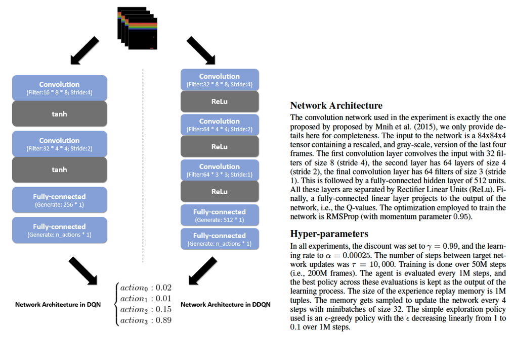

实验结果如下：
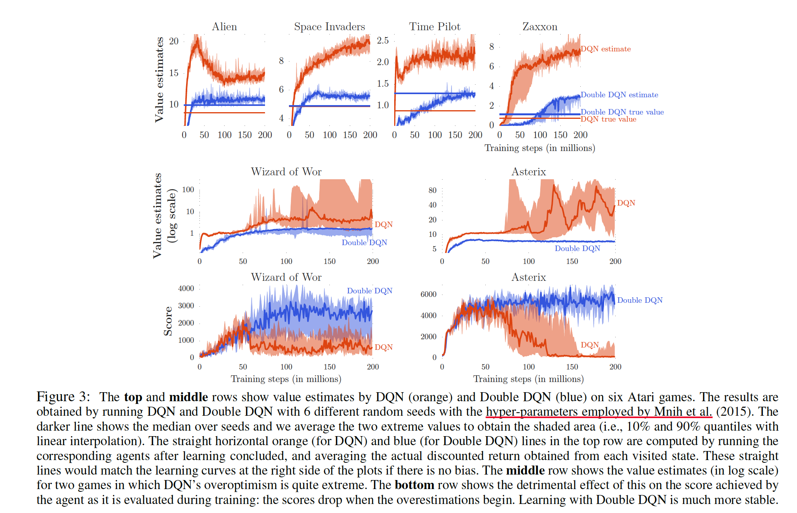


> 对于Atari游戏来讲，我们很难说某个状态的Q值等于多少，一般情况是将训练好的策略去运行游戏，然后根据游戏中积累reward，就能得到平均的reward作为true value了。
+ 从实验第一行结果我们明显可以看出在集中游戏中，值函数相对于Double DQN都明显的比较高（如果没有过高估计的话，收敛之后我们的估值应该跟真实值相同的），此处说明过高估计确实不容易避免。
+ Wizard of Wor和Asterix这两个游戏可以看出，DQN的结果比较不稳定。也表明过高估计会影响到学习的性能的稳定性。**因此不稳定的问题的本质原因还是对Q值的过高估计**。
+ 对于鲁棒性的测试


此外作者为了对游戏有一个统计学意义上的总结，对分数进行了正则化，表示为：
$$
\text { score  }_{\text{normalized}}=\frac{\text {score}_{\text{agent}}-\text { score}_{\text{random}}}{\text { score}_{\text{human}}-\text { score}_{\text{random}}}
$$
实验结果如下：
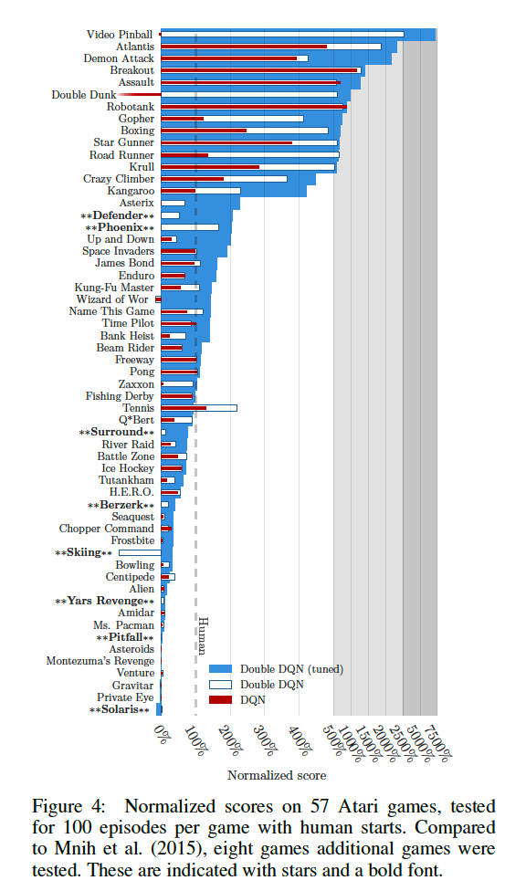

以上基本上是本论文的内容，下面我们借助实验进行code的Double DQN算法。其实本部分的复现只是将更新的DQN的目标函数换一下。对于论文中的多项式拟合并不做复现。

### 3. 代码复现

此处采用Morvan的代码，实验环境是：Tensorflow=1.0&gym=0.8.0,先coding一个智能体Agent

```python
# file name Agent.py

import numpy as np
import tensorflow as tf

np.random.seed(1)
tf.set_random_seed(1)

# Double DQN
class DoubleDQN:
    def __init__(
            self,
            n_actions,
            n_features,
            learning_rate=0.005,
            reward_decay=0.9,
            e_greedy=0.9,
            replace_target_iter=200,
            memory_size=3000,
            batch_size=32,
            e_greedy_increment=None,
            output_graph=False,
            double_q=True,
            sess=None,
    ):
        self.n_actions = n_actions
        self.n_features = n_features
        self.lr = learning_rate
        self.gamma = reward_decay
        self.epsilon_max = e_greedy
        self.replace_target_iter = replace_target_iter
        self.memory_size = memory_size
        self.batch_size = batch_size
        self.epsilon_increment = e_greedy_increment
        self.epsilon = 0 if e_greedy_increment is not None else self.epsilon_max

        self.double_q = double_q    # decide to use double q or not

        self.learn_step_counter = 0
        self.memory = np.zeros((self.memory_size, n_features*2+2))
        self._build_net()
        t_params = tf.get_collection('target_net_params')
        e_params = tf.get_collection('eval_net_params')
        self.replace_target_op = [tf.assign(t, e) for t, e in zip(t_params, e_params)]

        if sess is None:
            self.sess = tf.Session()
            self.sess.run(tf.global_variables_initializer())
        else:
            self.sess = sess
        if output_graph:
            tf.summary.FileWriter("logs/", self.sess.graph)
        self.cost_his = []

    def _build_net(self):
        def build_layers(s, c_names, n_l1, w_initializer, b_initializer):
            with tf.variable_scope('l1'):
                w1 = tf.get_variable('w1', [self.n_features, n_l1], initializer=w_initializer, collections=c_names)
                b1 = tf.get_variable('b1', [1, n_l1], initializer=b_initializer, collections=c_names)
                l1 = tf.nn.relu(tf.matmul(s, w1) + b1)

            with tf.variable_scope('l2'):
                w2 = tf.get_variable('w2', [n_l1, self.n_actions], initializer=w_initializer, collections=c_names)
                b2 = tf.get_variable('b2', [1, self.n_actions], initializer=b_initializer, collections=c_names)
                out = tf.matmul(l1, w2) + b2
            return out
        # ------------------ build evaluate_net ------------------
        self.s = tf.placeholder(tf.float32, [None, self.n_features], name='s')  # input
        self.q_target = tf.placeholder(tf.float32, [None, self.n_actions], name='Q_target')  # for calculating loss

        with tf.variable_scope('eval_net'):
            c_names, n_l1, w_initializer, b_initializer = \
                ['eval_net_params', tf.GraphKeys.GLOBAL_VARIABLES], 20, \
                tf.random_normal_initializer(0., 0.3), tf.constant_initializer(0.1)  # config of layers

            self.q_eval = build_layers(self.s, c_names, n_l1, w_initializer, b_initializer)

        with tf.variable_scope('loss'):
            self.loss = tf.reduce_mean(tf.squared_difference(self.q_target, self.q_eval))
        with tf.variable_scope('train'):
            self._train_op = tf.train.RMSPropOptimizer(self.lr).minimize(self.loss)

        # ------------------ build target_net ------------------
        self.s_ = tf.placeholder(tf.float32, [None, self.n_features], name='s_')    # input
        with tf.variable_scope('target_net'):
            c_names = ['target_net_params', tf.GraphKeys.GLOBAL_VARIABLES]

            self.q_next = build_layers(self.s_, c_names, n_l1, w_initializer, b_initializer)

    def store_transition(self, s, a, r, s_):
        if not hasattr(self, 'memory_counter'):
            self.memory_counter = 0
        transition = np.hstack((s, [a, r], s_))
        index = self.memory_counter % self.memory_size
        self.memory[index, :] = transition
        self.memory_counter += 1

    def choose_action(self, observation):
        observation = observation[np.newaxis, :]
        actions_value = self.sess.run(self.q_eval, feed_dict={self.s: observation})
        action = np.argmax(actions_value)

        if not hasattr(self, 'q'):  # record action value it gets
            self.q = []
            self.running_q = 0
        self.running_q = self.running_q*0.99 + 0.01 * np.max(actions_value)
        self.q.append(self.running_q)

        if np.random.uniform() > self.epsilon:  # choosing action
            action = np.random.randint(0, self.n_actions)
        return action

    def learn(self):
        if self.learn_step_counter % self.replace_target_iter == 0:
            self.sess.run(self.replace_target_op)
            print('\ntarget_params_replaced\n')

        if self.memory_counter > self.memory_size:
            sample_index = np.random.choice(self.memory_size, size=self.batch_size)
        else:
            sample_index = np.random.choice(self.memory_counter, size=self.batch_size)
        batch_memory = self.memory[sample_index, :]

        q_next, q_eval4next = self.sess.run(
            [self.q_next, self.q_eval],
            feed_dict={self.s_: batch_memory[:, -self.n_features:],    # next observation
                       self.s: batch_memory[:, -self.n_features:]})    # next observation
        q_eval = self.sess.run(self.q_eval, {self.s: batch_memory[:, :self.n_features]})

        q_target = q_eval.copy()

        batch_index = np.arange(self.batch_size, dtype=np.int32)
        eval_act_index = batch_memory[:, self.n_features].astype(int)
        reward = batch_memory[:, self.n_features + 1]
        # Double DQN算法和DQN算法的区别。
        if self.double_q:
            max_act4next = np.argmax(q_eval4next, axis=1)        # the action that brings the highest value is evaluated by q_eval
            selected_q_next = q_next[batch_index, max_act4next]  # Double DQN, select q_next depending on above actions
        else:
            selected_q_next = np.max(q_next, axis=1)    # the natural DQN

        q_target[batch_index, eval_act_index] = reward + self.gamma * selected_q_next

        _, self.cost = self.sess.run([self._train_op, self.loss],
                                     feed_dict={self.s: batch_memory[:, :self.n_features],
                                                self.q_target: q_target})
        self.cost_his.append(self.cost)

        self.epsilon = self.epsilon + self.epsilon_increment if self.epsilon < self.epsilon_max else self.epsilon_max
        self.learn_step_counter += 1

```
主函数入口：
```python
import gym
from Agent import DoubleDQN
import numpy as np
import matplotlib.pyplot as plt
import tensorflow as tf


env = gym.make('Pendulum-v0')
env = env.unwrapped
env.seed(1)
MEMORY_SIZE = 3000
ACTION_SPACE = 11

sess = tf.Session()
with tf.variable_scope('Natural_DQN'):
    natural_DQN = DoubleDQN(
        n_actions=ACTION_SPACE, n_features=3, memory_size=MEMORY_SIZE,
        e_greedy_increment=0.001, double_q=False, sess=sess
    )

with tf.variable_scope('Double_DQN'):
    double_DQN = DoubleDQN(
        n_actions=ACTION_SPACE, n_features=3, memory_size=MEMORY_SIZE,
        e_greedy_increment=0.001, double_q=True, sess=sess, output_graph=True)

sess.run(tf.global_variables_initializer())


def train(RL):
    total_steps = 0
    observation = env.reset()
    while True:
        # if total_steps - MEMORY_SIZE > 8000: env.render()

        action = RL.choose_action(observation)

        f_action = (action-(ACTION_SPACE-1)/2)/((ACTION_SPACE-1)/4)   # convert to [-2 ~ 2] float actions
        observation_, reward, done, info = env.step(np.array([f_action]))

        reward /= 10     # normalize to a range of (-1, 0). r = 0 when get upright
        # the Q target at upright state will be 0, because Q_target = r + gamma * Qmax(s', a') = 0 + gamma * 0
        # so when Q at this state is greater than 0, the agent overestimates the Q. Please refer to the final result.

        RL.store_transition(observation, action, reward, observation_)

        if total_steps > MEMORY_SIZE:   # learning
            RL.learn()

        if total_steps - MEMORY_SIZE > 20000:   # stop game
            break

        observation = observation_
        total_steps += 1
    return RL.q

q_natural = train(natural_DQN)
q_double = train(double_DQN)

plt.plot(np.array(q_natural), c='r', label='natural')
plt.plot(np.array(q_double), c='b', label='double')
plt.legend(loc='best')
plt.ylabel('Q eval')
plt.xlabel('training steps')
plt.grid()
plt.show()
```

参考文献：
[1]. [Deep Reinforcement Learning with Double Q-learning](https://arxiv.org/pdf/1509.06461.pdf)  by Hado van Hasselt and Arthur Guez and David Silver,DeepMind
[2].[JUNMO的博客: junmo1215.github.io](https://junmo1215.github.io/paper/2017/12/08/Note-Deep-Reinforcement-Learning-with-Double-Q-learning.html)
[3]. [Morvanzhou的Github](https://github.com/MorvanZhou/Reinforcement-learning-with-tensorflow/tree/master/contents/5.1_Double_DQN)