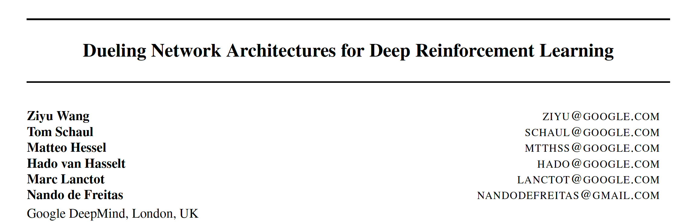
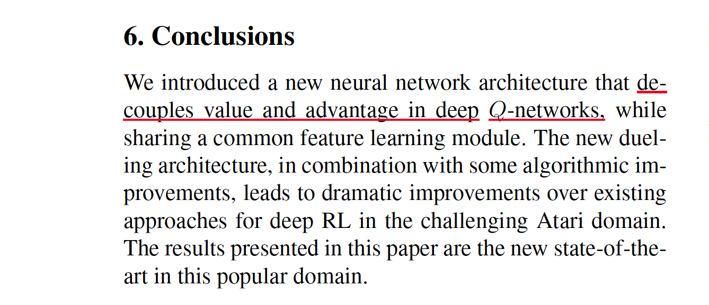
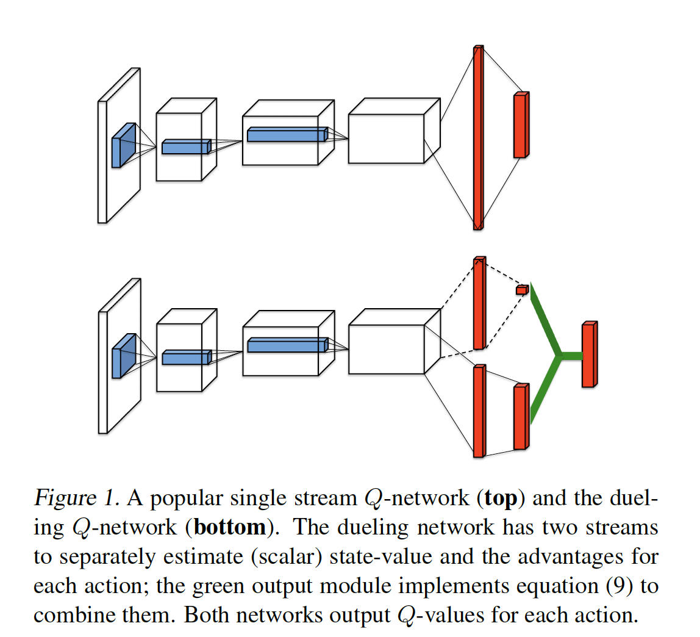
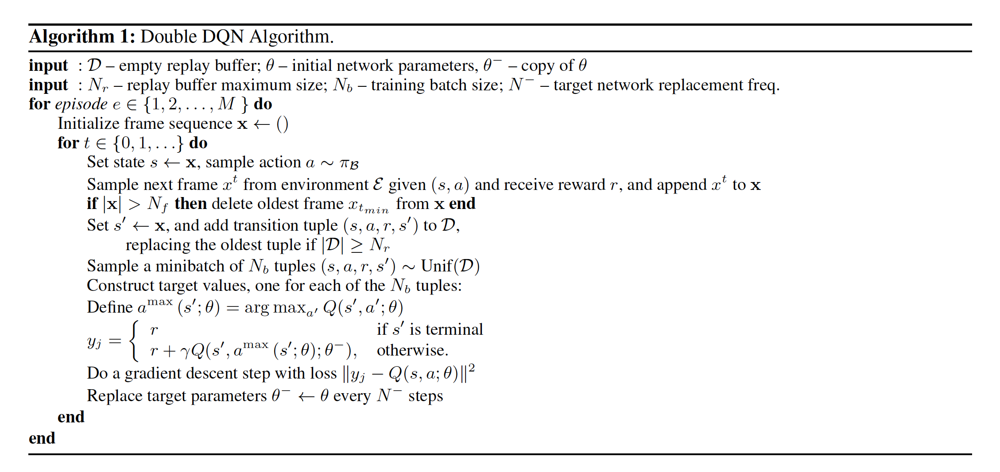
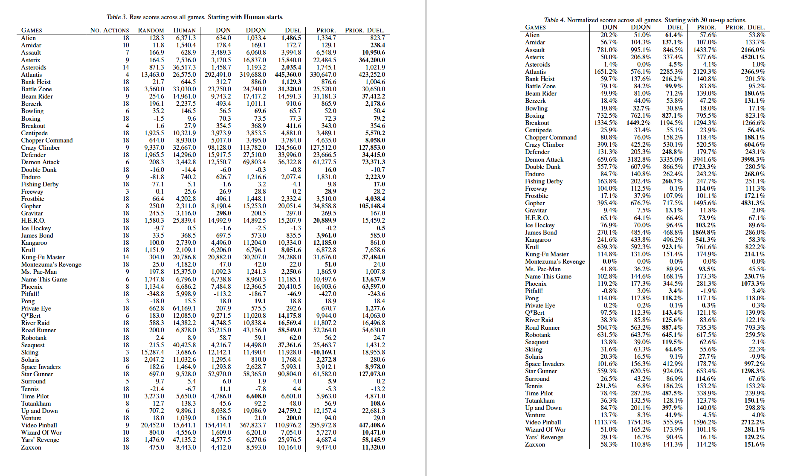

本文是DeepMind发表于ICML2016顶会的文章（获得Best Paper奖），第一作者Ziyu Wang（第四作Hado Van Hasselt就是前几篇文章[#Double Q-learning#](https://blog.csdn.net/gsww404/article/details/103413124)，[Double DQN](https://blog.csdn.net/gsww404/article/details/103583784)的作者），可以说他们开创了DQN，后续还有几个DeepMind的文章。

### 1. 问题阐述
在前面已经学习了
+ [Q-learning](https://blog.csdn.net/gsww404/article/details/103566859)
+ [Double Q-learning](https://blog.csdn.net/gsww404/article/details/103413124)： 解决值函数**过估计问题**
+ [DQN](https://blog.csdn.net/gsww404/article/details/79763051)： 解决**大状态空间、动作空间**问题
+ [Double DQN](https://blog.csdn.net/gsww404/article/details/103583784)： 解决值函数**过估计问题**
+ [PER-DQN](https://blog.csdn.net/gsww404/article/details/103673852): 解决经验回放的**采样问题**

### 2. 算法原理和过程

#### 2.n 算法伪代码

#### 2.5 实现结果

### 3. 代码复现

