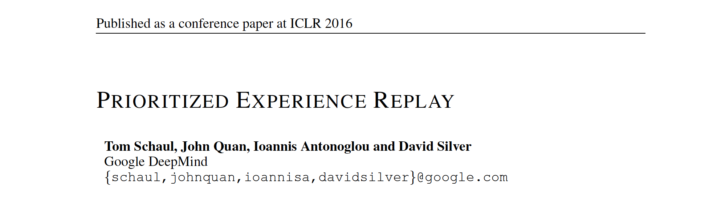

论文地址： https://arxiv.org/abs/1511.05952

> 本论文是由DeepMind操刀，Schaul主导完成的文章，发表于顶会ICLR2016上，主要解决经验回放中的”**采样问题**“（在DQN算法中使用了经典的”experience replay“，但存在一个问题是其采用**均匀采样和批次更新**，导致特别少但价值特别高的经验没有被高效的利用）。

还是往常的学习顺序，先摘要和结论
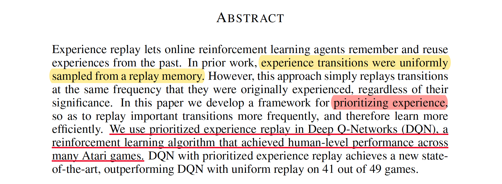

通常情况下，在使用“经验”回放的算法中，通常从缓冲池中采用“**均匀采样(Uniformly sampling)**”，虽然这种方法在[DQN算法](https://blog.csdn.net/gsww404/article/details/79763051)中取得了不错的效果并登顶Nature，但其缺点仍然值得探讨，本文提出了一种 **“优先级经验回放（prioritized experience reolay）”** 技术去解决采样问题，并将这种方法应用在DQN中实现了state-of-the-art的水平。
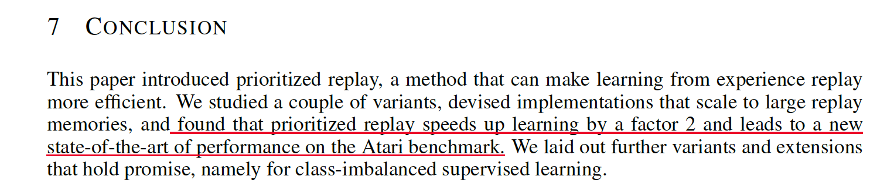
结论表明，该方法不仅可以提升效果，还可以  **加速学习速度**。下面开始正文

### 1. 问题阐述
#### 1.1 均匀采样缺点
在诸如DQN算法的强化学习中经常遇到两个问题：
+ 基于梯度的更新打破了数据之间的**独立同分布(i.i.d.)** 假设问题
+ 快速忘记了一些罕见重要的、以后使用的经验数据

而**经验回放**的广泛使用解决了上述痛点，其过程分为两个阶段，存放和利用(如何采样抽取)，传统的采样使用均匀的方式随机的从下表中获取mini-bathch的数据进行学习。

transition | 
-|-|-
<$s_{1}$,$a_{1}$,$r_{1}$,$s_{2}$> |
<$s_{2}$,$a_{2}$,$r_{2}$,$s_{3}$> | 
.... |
<$s_{n}$,$a_{n}$,$r_{n}$,$s_{n+1}$>| 

所以问题归结于"如何从上表中的experience中以mini-batch的方式选取数据学习呢？"，即 **如何采样(sampling)?**


作者拿一个具体的例子来说明均匀采样有什么问题，假设有一个如下图所示的environment，它有$n$个状态，2个动作，初始状态为1，状态转移如箭头所示，当且仅当沿绿色箭头走的时候会有1的reward，其余情况的reward均为0。那么假如采用随机策略从初始状态开始走n步，我们能够获得有用的信息（reward非0）的可能性为$\frac{1}{2^{n}}$。也就是说，假如我们把各transition都存了起来，**然后采用均匀采样来取transition，我们仅有$\frac{1}{2^{n}}$的概率取到有用的信息**，这样的话学习效率就会很低。

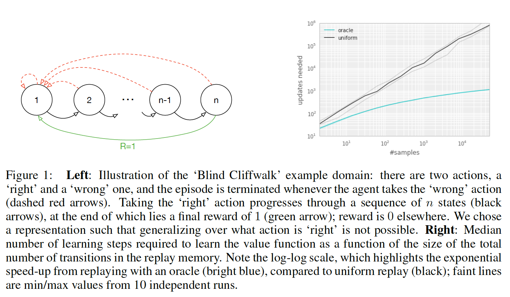

实验结果如图右方所示所示：说明transition的选取顺序对学习效率有很大的影响。下图横轴代表experience replay的大小，纵轴表示学习所需的更新次数。黑色的线表示采用均匀采样得到的结果，绿色的线表示每次都选取”最好“的transition的结果。可以看到，这个效率提升是很明显的。
#### 1.2 衡量指标 TD-error
作者首先给出了一个衡量指标：“TD-error”，随后贪心地选”信息量“最大的transition，然而这种方法存在以下缺陷：
+ 由于考虑到算法效率，不会每次critic更新后都更新所有transition的TD-error，我们只会更新当次取到的transition的TD-error。因此transition的TD-error对应的critic是以前的critic（更准确地说，是上次取到该transition时的critic）而不是当前的critic。也就是说某一个transition的TD-error较低，只能够说明它对之前的critic“信息量”不大，而不能说明它对当前的critic“信息量”不大，因此根据TD-error进行贪心有可能会错过对当前critic“信息量”大的transition。
+ 容易overfitting：基于贪心的做法还容易“旱的旱死，涝的涝死”，因为从原理上来说，被选中的transition的TD-error在critic更新后会下降，然后排到后面去，下一次就不会选中这些transition），来来去去都是那几个transition，导致overfitting。


### 2. 算法原理和过程

作者在本文提出的优先级通过更加频繁的更新去衡量“TD-error”，然而优先级也会带来的多样性损失问题，作者则利用随机优先级采样、偏置和重要性采样来避免该问题。为了处理上述问题，作者提出stochastic prioritization，随机化的采样过程，“信息量”越大，被抽中的概率越大，但即使是“信息量”最大的transition，也不一定会被抽中，仅仅只是被抽中的概率较大。

 Prioritized DQN能够成功的主要原因有两个：
 + sum tree这种数据结构带来的采样的O(log n)的高效率
 + Weighted Importance sampling的正确估计

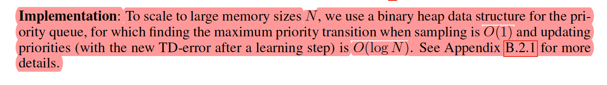

#### 2.1 随机优先级采样方法
为了解决贪心优先级造成的在函数逼近过程中频繁的有一个较高的error、过拟合等问题，**一种结合纯贪心采样和和均匀分布采样的随机采样方法**被提出。并确保在transition的优先级中采样的概率是单调的，同时即使对于最低优先级的transition也要保证非零概率。并定义采样的概率为：
$$
P(i)=\frac{p_{i}^{\alpha}}{\sum_{k} p_{k}^{\alpha}}
$$
其中$p_{i}$为第$i$个transition的priority，$\alpha$用于调节优先程度（$\alpha=0$的时候退化为均匀采样)，以下两种方案的区别在于对priority的定义不同。
##### 2.1.1 第一种变体：proportional prioritization(比例优先级)

$p_{i}=|\delta_{i}|+\epsilon$ ，其中$\delta_{i}$为TD-error，$\epsilon$用于防止概率为0，实现的时候采用sum tree的数据结构。

---

**SumTree方法**
 
**1.为什么使用SumTree？**
假设有一个数据列表，并且需要从列表中随机抽取数据。您可以做的一件事是生成一个介于零和列表大小之间的随机整数，并从列表中检索数据

```python
#!/usr/bin/python
# -*- coding: utf-8 -*-
data_list = np.array（np.random.rand（100））    
＃数据生成  
index = np.random.randint（0，len（data_list））  
data = data_list [index]  
print（data）
```
使用这种方法，将能够以等价方式从列表中获取数据。如果需要从列表中获得更高优先级的数据，该怎么办？ 有没有一种可以为某些高优先级数据提供较高的检索率方法呢？

**《1》** 方法1： 尝试**按优先级从高到低的顺序**对**数据列表进行排序**。然后从生成器中获取一个随机数，该生成器有很大的机会给出接近零的数字，而当该数字远离零时则具有较低的机会。均值等于零的高斯随机数生成器可能会起作用。您可以相应地调整sigma。
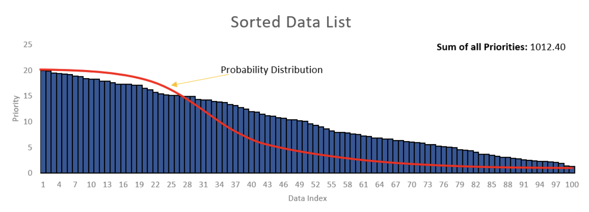
> 这里的主要问题是如何调整sigma以适合列表的大小。如果列表的大小增加了，那么您将需要再次调整sigma。另外，如果生成器提供的数字大于列表的大小，该怎么办？因此，该方法将不可行。

**《2》** 方法二：根据均匀分布在数据列表中的零和总优先级值之和之间生成一个随机数（在示例中为1012.4）。假设从随机数生成器获得了数字430.58。然后必须从左到右对列表的优先级值求和，直到总和超过430.58。
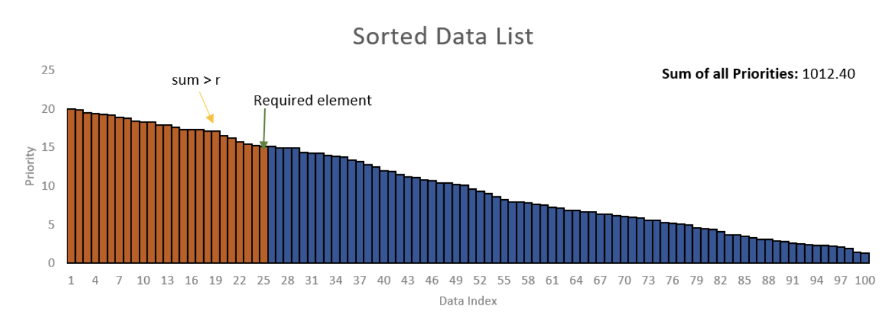

在上面的示例中，前24个元素427.7的总和为，而所有前25个元素的总和为442.8。因此，第25个元素是您需要从列表中检索的元素。但是这样还是比较繁琐。

在下图这种情况下，总概率为68。根据均匀分布生成一个随机数。如果生成的数字介于之间0-17，则必须从列表中选择第一个元素。如果介于之间18-30，则必须选择第二个元素，依此类推，这样从数据列表中检索第一个元素的机会更高。其实考虑一下，如果遵循求和方法，则无需进行排序，则有较高的机会检索具有较高概率值的元素。如图右。
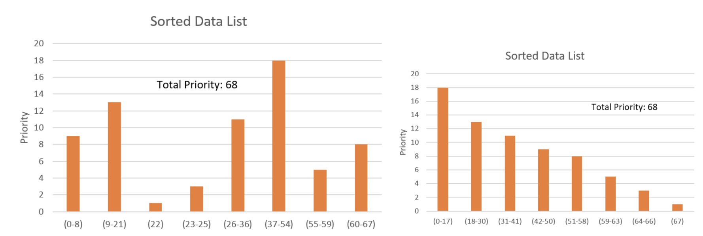

**这种方法非常有趣，但是它的复杂性$\mathcal {O}(n)$。如果有大量数据，则此方法将非常痛苦。**
那么什么方法可以将线性数据结构的复杂度$\mathcal {O}(n)$ 降下来呢？也就是将复杂度降到 $\mathcal {O}(\log n)$呢？
答案基本是肯定的：“**树形**”数据结构，这里使用了**SumTree（求和树）技术**
2.什么是SumTree？
> **定义**： SumTree（求和树）是一种特殊的二叉树，其中父节点的值等于其子节点的值之和，如下图所示，根节点的值是所有叶子的值的和：13 = 3+10,42 = 29+13,依此类推......
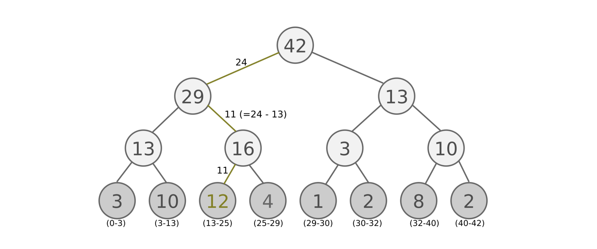
这里的Node的值，我们将其定义为**每个经验样本一个优先度(priority)**
优先度定义为：
$$
priority = TD - error(Q_{target}-Q_{value})
$$
表示如果TD-error愈大，则代表这个样本预测精度还有很多上升空间，意味着更需要被学习，也就是优先度(priority)愈高，其中，**leaf上的数值是priority，也就是最底下那一层就是叶子(leaf)**
> **基本原理**：
在抽样时, 将root priority 除以batch_size, 分成batch_size个区间，$$n=sum(p)/batch_size$$
如果root node 的priority 是42的话, 如果抽6个样本, 这时的区间拥有的priority可能是这样.
**[0-7], [7-14], [14-21], [21-28], [28-35], [35-42]**
然后在每个区间随机选取一个数(value)，比如在区间[21-28]选到了24，就按照这个24从最顶上的42开始向下搜索，首先看到最顶上的42下面有两个child nodes,拿着手中的24对比左边的child 29，如果左边的child比自己手中的值大，那就走左边这条路，接着再对比29下面左边那个点13这时手中的24比13大，那就走右边那条路，并且将手中的值根据13修改一下，变成24–13=11，接着拿着11和13左下角的12比，结果12比11大，那就选12当作这次选到的priority，并且也选择12对应的数据。之后就在这几个区间内分别做均匀采样，最后取得6个transition。
---
下面进行SumTree的实现

```python
import numpy as np
 
class Tree(object):
    write = 0
 
    def __init__(self, capacity):
        self.capacity = capacity  # capacity是叶子节点个数，
        self.tree = np.zeros(2 * capacity)  # 从1开始编号[1,capacity]
        self.data = np.zeros(capacity+1, dtype=object)  # 存叶子节点对应的数据data[叶子节点编号id] = data
 
    def add(self, p, data):
        idx = self.write + self.capacity  
        self.data[self.write+1] = data
        self._updatetree(idx, p)
        self.write += 1
        if self.write > self.capacity:  
            self.write = 0
 
    def _updatetree(self, idx, p):
        change = p - self.tree[idx]  
        self._propagate(idx, change)  
        self.tree[idx] = p  
 
    def _propagate(self, idx, change):
        parent = idx // 2  
        self.tree[parent] += change  # 更新父节点的值，是向上传播的体现
        if parent != 1:
            self._propagate(parent, change)  
 
    def _total(self):
        return self.tree[1]  
 
    def get(self, s):
        idx = self._retrieve(1, s)  
        index_data = idx - self.capacity + 1  
        return (idx, self.tree[idx], self.data[index_data])
 
    def _retrieve(self, idx, s):
        left = 2 * idx  
        right = left + 1
        if left >= (len(self.tree)-1):  
            return idx
        if s <= self.tree[left]:
            return self._retrieve(left, s)  # 往左孩子处查找
        else:
            return self._retrieve(right, s - self.tree[left])  # 往右孩子处查找
 
tree = Tree(5)
tree.add(1,3)
tree.add(2,4)
tree.add(3,5)
tree.add(4,6)
tree.add(6,11)
print(tree.get(4))  # (8, 4.0, 6)
```

##### 2.1.2 第二种变体：rank-based prioritization(基于排名的优先级)
###### 2.1.2.1  基于优先级rank数学表示为：
$$ p_{i}=\frac{1}{rank(i)} $$
这里定性地考虑priority，没有定量地考虑priority。实现类似分层抽样，事先将排名段分为几个等概率区间，再在各个等概率区间里面均匀采样，其中在采样的过程中采用了热偏置处理。

###### 2.1.2.2 热偏置(Annealing The Bias) 
> **Importance samplingn(重要性采样)**
重要性采样是统计学中估计某一分布性质时使用的一种方法。该方法从与原分布不同的另一个分布中采样，而对原先分布的性质进行估计，数学表示为：
$$
\begin{aligned}
\mathbb{E}_{x \sim A}[f(x)] &= \sum_{x} P_{A}(x) f(x) \\
 &= \sum_{x} P_{B}(x) \frac{P_{A}(x)}{P_{B}(x)} f(x)  \\
 &= \mathbb{E}_{x \sim B}\left[\frac{P_{A}(x)}{P_{B}(x)} f(x)\right]
\end{aligned}
$$

利用随机更新得来的期望值往往依赖于这些更新，优先回放引入了误差，因为它以一种不受控的形式改变了分布，从而改变了预测会收敛到的solution（即使policy和状态分布都固定），通常可以用下面的重要性采样权重来修正该误差（见2.1.4伪代码）：
$$
\begin{aligned}
w_{j}&=\frac{(N * P(j))^{-\beta}}{\max _{i}\left(w_{i}\right)} \\
&=\frac{(N * P(j))^{-\beta}}{\max _{i}\left((N * P(i))^{-\beta}\right)}\\
&=\frac{(P(j))^{-\beta}}{\max _{i}\left((P(i))^{-\beta}\right)}\\
&=\left(\frac{p_{j}}{\min _{i} P(i)}\right)^{-\beta}
\end{aligned}
$$

采样过程的实现如下：
```python
def sample(self, n):
        b_idx, b_memory, ISWeights = np.empty((n,), dtype=np.int32), np.empty((n, self.tree.data[0].size)), np.empty((n, 1))
        pri_seg = self.tree.total_p / n       # priority segment
        self.beta = np.min([1., self.beta + self.beta_increment_per_sampling])  # max = 1
 
        min_prob = np.min(self.tree.tree[-self.tree.capacity:]) / self.tree.total_p     # for later calculate ISweight
        if min_prob == 0:
            min_prob = 0.00001
        for i in range(n):
            a, b = pri_seg * i, pri_seg * (i + 1)
            v = np.random.uniform(a, b)
            idx, p, data = self.tree.get_leaf(v)
            prob = p / self.tree.total_p
            ISWeights[i, 0] = np.power(prob/min_prob, -self.beta)
            b_idx[i], b_memory[i, :] = idx, data
        return b_idx, b_memory, ISWeights
```
通过以上，已经将要采样的区间划分为n段切每段进行均匀采样，当我们拿到第i段的均匀采样值v以后，就可以去SumTree中找对应的叶子节点拿**样本数据、样本叶子节点序号以及样本优先级**。代码如下：
```python
def get_leaf(self, v):
        """
        Tree structure and array storage:
        Tree index:
        -> storing priority sum
            / \
    2
         / \   / \
  4 5   6    -> storing priority for transitions
        Array type for storing:
        [0,1,2,3,4,5,6]
        """
        parent_idx = 0
        while True:     # the while loop is faster than the method in the reference code
            cl_idx = 2 * parent_idx + 1         # this leaf's left and right kids
            cr_idx = cl_idx + 1
            if cl_idx >= len(self.tree):        # reach bottom, end search
                leaf_idx = parent_idx
                break
            else:       # downward search, always search for a higher priority node
                if v <= self.tree[cl_idx]:
                    parent_idx = cl_idx
                else:
                    v -= self.tree[cl_idx]
                    parent_idx = cr_idx
 
        data_idx = leaf_idx - self.capacity + 1
        return leaf_idx, self.tree[leaf_idx], self.data[data_idx]
```

**总结：和DQN比，DDQN的TensorFlow网络结构流程中多了一个TD误差的计算节点，以及损失函数多了一个ISWeights系数。**


#### 2.1.4 算法伪代码如下：
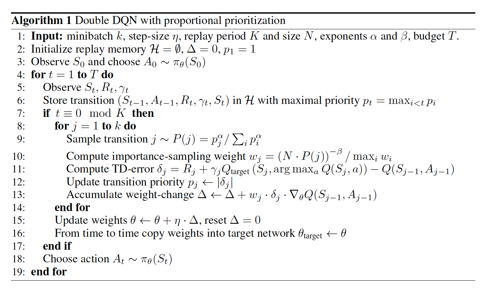

#### 2.3 实验结果：
实验结果部分的谈论本文不作过多讨论，具体结果如下，感兴趣的请阅读原论文
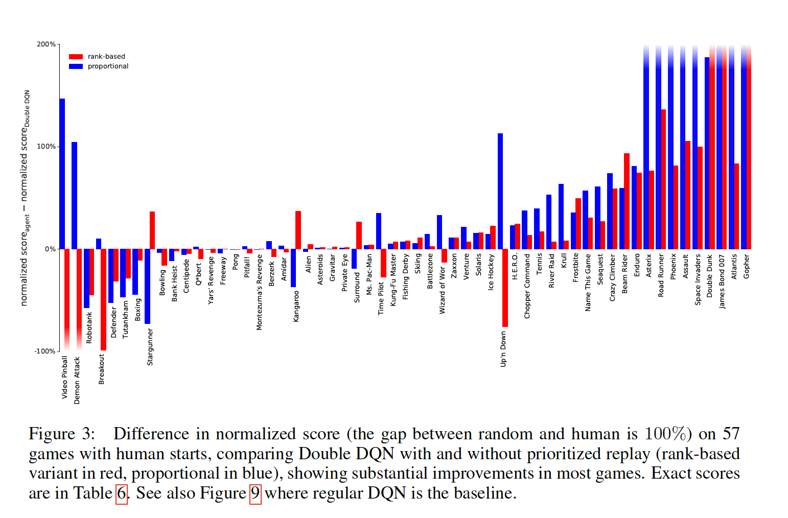

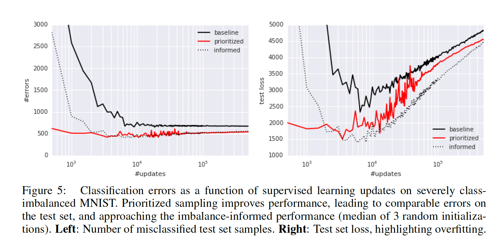

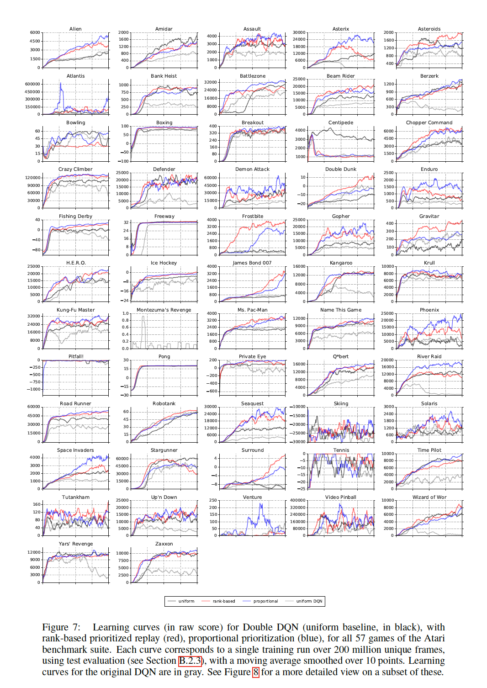

### 3. 代码复现
```python
import gym
import tensorflow as tf
import numpy as np
import random
from collections import deque

# Hyper Parameters for DQN
GAMMA = 0.9 # discount factor for target Q
INITIAL_EPSILON = 0.5 # starting value of epsilon
FINAL_EPSILON = 0.01 # final value of epsilon
REPLAY_SIZE = 10000 # experience replay buffer size
BATCH_SIZE = 128 # size of minibatch
REPLACE_TARGET_FREQ = 10 # frequency to update target Q network

class SumTree(object):
    """
    This SumTree code is a modified version and the original code is from:
    https://github.com/jaara/AI-blog/blob/master/SumTree.py
    Story data with its priority in the tree.
    """
    data_pointer = 0

    def __init__(self, capacity):
        self.capacity = capacity  # for all priority values
        self.tree = np.zeros(2 * capacity - 1)
        # [--------------Parent nodes-------------][-------leaves to recode priority-------]
        #             size: capacity - 1                       size: capacity
        self.data = np.zeros(capacity, dtype=object)  # for all transitions
        # [--------------data frame-------------]
        #             size: capacity

    def add(self, p, data):
        tree_idx = self.data_pointer + self.capacity - 1
        self.data[self.data_pointer] = data  # update data_frame
        self.update(tree_idx, p)  # update tree_frame

        self.data_pointer += 1
        if self.data_pointer >= self.capacity:  # replace when exceed the capacity
            self.data_pointer = 0

    def update(self, tree_idx, p):
        change = p - self.tree[tree_idx]
        self.tree[tree_idx] = p
        # then propagate the change through tree
        while tree_idx != 0:    # this method is faster than the recursive loop in the reference code
            tree_idx = (tree_idx - 1) // 2
            self.tree[tree_idx] += change

    def get_leaf(self, v):
        """
        Tree structure and array storage:
        Tree index:
             0         -> storing priority sum
            / \
          1     2
         / \   / \
        3   4 5   6    -> storing priority for transitions
        Array type for storing:
        [0,1,2,3,4,5,6]
        """
        parent_idx = 0
        while True:     # the while loop is faster than the method in the reference code
            cl_idx = 2 * parent_idx + 1         # this leaf's left and right kids
            cr_idx = cl_idx + 1
            if cl_idx >= len(self.tree):        # reach bottom, end search
                leaf_idx = parent_idx
                break
            else:       # downward search, always search for a higher priority node
                if v <= self.tree[cl_idx]:
                    parent_idx = cl_idx
                else:
                    v -= self.tree[cl_idx]
                    parent_idx = cr_idx

        data_idx = leaf_idx - self.capacity + 1
        return leaf_idx, self.tree[leaf_idx], self.data[data_idx]

    @property
    def total_p(self):
        return self.tree[0]  # the root


class Memory(object):  # stored as ( s, a, r, s_ ) in SumTree
    """
    This Memory class is modified based on the original code from:
    https://github.com/jaara/AI-blog/blob/master/Seaquest-DDQN-PER.py
    """
    epsilon = 0.01  # small amount to avoid zero priority
    alpha = 0.6  # [0~1] convert the importance of TD error to priority
    beta = 0.4  # importance-sampling, from initial value increasing to 1
    beta_increment_per_sampling = 0.001
    abs_err_upper = 1.  # clipped abs error

    def __init__(self, capacity):
        self.tree = SumTree(capacity)

    def store(self, transition):
        max_p = np.max(self.tree.tree[-self.tree.capacity:])
        if max_p == 0:
            max_p = self.abs_err_upper
        self.tree.add(max_p, transition)   # set the max p for new p

    def sample(self, n):
        b_idx, b_memory, ISWeights = np.empty((n,), dtype=np.int32), np.empty((n, self.tree.data[0].size)), np.empty((n, 1))
        pri_seg = self.tree.total_p / n       # priority segment
        self.beta = np.min([1., self.beta + self.beta_increment_per_sampling])  # max = 1

        min_prob = np.min(self.tree.tree[-self.tree.capacity:]) / self.tree.total_p     # for later calculate ISweight
        if min_prob == 0:
            min_prob = 0.00001
        for i in range(n):
            a, b = pri_seg * i, pri_seg * (i + 1)
            v = np.random.uniform(a, b)
            idx, p, data = self.tree.get_leaf(v)
            prob = p / self.tree.total_p
            ISWeights[i, 0] = np.power(prob/min_prob, -self.beta)
            b_idx[i], b_memory[i, :] = idx, data
        return b_idx, b_memory, ISWeights

    def batch_update(self, tree_idx, abs_errors):
        abs_errors += self.epsilon  # convert to abs and avoid 0
        clipped_errors = np.minimum(abs_errors, self.abs_err_upper)
        ps = np.power(clipped_errors, self.alpha)
        for ti, p in zip(tree_idx, ps):
            self.tree.update(ti, p)

class DQN():
  # DQN Agent
  def __init__(self, env):
    # init experience replay
    self.replay_total = 0
    # init some parameters
    self.time_step = 0
    self.epsilon = INITIAL_EPSILON
    self.state_dim = env.observation_space.shape[0]
    self.action_dim = env.action_space.n
    self.memory = Memory(capacity=REPLAY_SIZE)

    self.create_Q_network()
    self.create_training_method()

    # Init session
    self.session = tf.InteractiveSession()
    self.session.run(tf.global_variables_initializer())

  def create_Q_network(self):
    # input layer
    self.state_input = tf.placeholder("float", [None, self.state_dim])
    self.ISWeights = tf.placeholder(tf.float32, [None, 1])
    # network weights
    with tf.variable_scope('current_net'):
        W1 = self.weight_variable([self.state_dim,20])
        b1 = self.bias_variable([20])
        W2 = self.weight_variable([20,self.action_dim])
        b2 = self.bias_variable([self.action_dim])

        # hidden layers
        h_layer = tf.nn.relu(tf.matmul(self.state_input,W1) + b1)
        # Q Value layer
        self.Q_value = tf.matmul(h_layer,W2) + b2

    with tf.variable_scope('target_net'):
        W1t = self.weight_variable([self.state_dim,20])
        b1t = self.bias_variable([20])
        W2t = self.weight_variable([20,self.action_dim])
        b2t = self.bias_variable([self.action_dim])

        # hidden layers
        h_layer_t = tf.nn.relu(tf.matmul(self.state_input,W1t) + b1t)
        # Q Value layer
        self.target_Q_value = tf.matmul(h_layer_t,W2t) + b2t

    t_params = tf.get_collection(tf.GraphKeys.GLOBAL_VARIABLES, scope='target_net')
    e_params = tf.get_collection(tf.GraphKeys.GLOBAL_VARIABLES, scope='current_net')

    with tf.variable_scope('soft_replacement'):
        self.target_replace_op = [tf.assign(t, e) for t, e in zip(t_params, e_params)]

  def create_training_method(self):
    self.action_input = tf.placeholder("float",[None,self.action_dim]) # one hot presentation
    self.y_input = tf.placeholder("float",[None])
    Q_action = tf.reduce_sum(tf.multiply(self.Q_value,self.action_input),reduction_indices = 1)
    self.cost = tf.reduce_mean(self.ISWeights *(tf.square(self.y_input - Q_action)))
    self.abs_errors =tf.abs(self.y_input - Q_action)
    self.optimizer = tf.train.AdamOptimizer(0.0001).minimize(self.cost)

  def store_transition(self, s, a, r, s_, done):
        transition = np.hstack((s, a, r, s_, done))
        self.memory.store(transition)    # have high priority for newly arrived transition

  def perceive(self,state,action,reward,next_state,done):
    one_hot_action = np.zeros(self.action_dim)
    one_hot_action[action] = 1
    #print(state,one_hot_action,reward,next_state,done)
    self.store_transition(state,one_hot_action,reward,next_state,done)
    self.replay_total += 1
    if self.replay_total > BATCH_SIZE:
        self.train_Q_network()

  def train_Q_network(self):
    self.time_step += 1
    # Step 1: obtain random minibatch from replay memory
    tree_idx, minibatch, ISWeights = self.memory.sample(BATCH_SIZE)
    state_batch = minibatch[:,0:4]
    action_batch =  minibatch[:,4:6]
    reward_batch = [data[6] for data in minibatch]
    next_state_batch = minibatch[:,7:11]
    # Step 2: calculate y
    y_batch = []
    current_Q_batch = self.Q_value.eval(feed_dict={self.state_input: next_state_batch})
    max_action_next = np.argmax(current_Q_batch, axis=1)
    target_Q_batch = self.target_Q_value.eval(feed_dict={self.state_input: next_state_batch})

    for i in range(0,BATCH_SIZE):
      done = minibatch[i][11]
      if done:
        y_batch.append(reward_batch[i])
      else :
        target_Q_value = target_Q_batch[i, max_action_next[i]]
        y_batch.append(reward_batch[i] + GAMMA * target_Q_value)

    self.optimizer.run(feed_dict={
      self.y_input:y_batch,
      self.action_input:action_batch,
      self.state_input:state_batch,
      self.ISWeights: ISWeights
      })
    _, abs_errors, _ = self.session.run([self.optimizer, self.abs_errors, self.cost], feed_dict={
                          self.y_input: y_batch,
                          self.action_input: action_batch,
                          self.state_input: state_batch,
                          self.ISWeights: ISWeights
                          })
    self.memory.batch_update(tree_idx, abs_errors)  # update priority

  def egreedy_action(self,state):
    Q_value = self.Q_value.eval(feed_dict = {
      self.state_input:[state]
      })[0]
    if random.random() <= self.epsilon:
        self.epsilon -= (INITIAL_EPSILON - FINAL_EPSILON) / 10000
        return random.randint(0,self.action_dim - 1)
    else:
        self.epsilon -= (INITIAL_EPSILON - FINAL_EPSILON) / 10000
        return np.argmax(Q_value)

  def action(self,state):
    return np.argmax(self.Q_value.eval(feed_dict = {
      self.state_input:[state]
      })[0])

  def update_target_q_network(self, episode):
    # update target Q netowrk
    if episode % REPLACE_TARGET_FREQ == 0:
        self.session.run(self.target_replace_op)
        #print('episode '+str(episode) +', target Q network params replaced!')

  def weight_variable(self,shape):
    initial = tf.truncated_normal(shape)
    return tf.Variable(initial)

  def bias_variable(self,shape):
    initial = tf.constant(0.01, shape = shape)
    return tf.Variable(initial)
# ---------------------------------------------------------
# Hyper Parameters
ENV_NAME = 'CartPole-v0'
EPISODE = 3000 # Episode limitation
STEP = 300 # Step limitation in an episode
TEST = 5 # The number of experiment test every 100 episode

def main():
  # initialize OpenAI Gym env and dqn agent
  env = gym.make(ENV_NAME)
  agent = DQN(env)

  for episode in range(EPISODE):
    # initialize task
    state = env.reset()
    # Train
    for step in range(STEP):
      action = agent.egreedy_action(state) # e-greedy action for train
      next_state,reward,done,_ = env.step(action)
      # Define reward for agent
      reward = -1 if done else 0.1
      agent.perceive(state,action,reward,next_state,done)
      state = next_state
      if done:
        break
    # Test every 100 episodes
    if episode % 100 == 0:
      total_reward = 0
      for i in range(TEST):
        state = env.reset()
        for j in range(STEP):
          env.render()
          action = agent.action(state) # direct action for test
          state,reward,done,_ = env.step(action)
          total_reward += reward
          if done:
            break
      ave_reward = total_reward/TEST
      print ('episode: ',episode,'Evaluation Average Reward:',ave_reward)
    agent.update_target_q_network(episode)

if __name__ == '__main__':
  main()
```
致谢：代码部分参考了[liujianping](https://www.cnblogs.com/pinard )，特别感谢，其他见参考文献。


参考文献
[1].https://arxiv.org/abs/1511.05952
[2].
[3].https://www.meltycriss.com/2018/03/18/paper-prioritized-experience-replay/
[4].https://www.fcodelabs.com/2019/03/18/Sum-Tree-Introduction/
[5].https://blog.csdn.net/song91425/article/details/81253519
[6].https://github.com/wucng/TensorExpand/blob/master/Deep%20Learning/Morvan%20Tutorial/Reinforcement%20Learning/4%20Deep%20Q%20Network/4.7%20Prioritized%20Experience%20Replay%20(DQN)%20(Tensorflow).md
[7].https://medium.com/@skywalker0803r/sumtree-algorithm-f150c0f7f0e4
[8].https://www.shuzhiduo.com/A/gVdnZyNNdW/
[9].https://www.cnblogs.com/pinard  