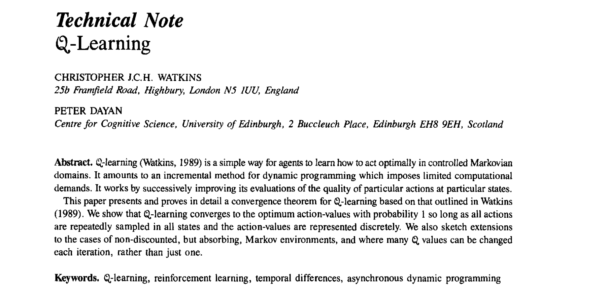
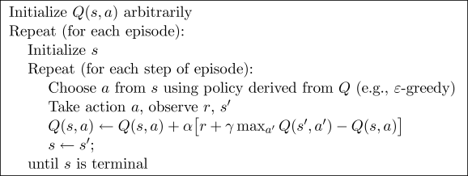
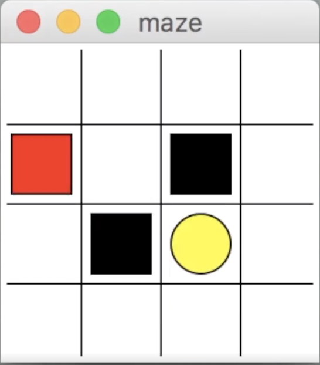

论文地址： http://www.gatsby.ucl.ac.uk/~dayan/papers/cjch.pdf
> Q-Learning是发表于1989年的一种value-based，且model-free的特别经典的off-policy算法，近几年的DQN等算法均是在此基础上通过神经网络进行展开的。
### 1. 相关简介
强化学习学习过程中，通常是将学习的序列数据存储在表格中，下次进行学习的时候通过获取表中的数据，并进行更新学习。

### 2. 原理及推导

Q-Learning就是在某一个时刻的状态(state)下，采取动作a能够获得收益的期望，环境会根据agent的动作反馈相应的reward奖赏，**核心就是将state和action构建成一张Q_table表来存储Q值，然后根据Q值来选取能够获得最大收益的动作**，如表所示：

|  Q-Table   | $a_{1}$ | $a_{2}$ | 
|  ----  | ----  |----  |
|  $s_{1}$ | $Q(s_{1},a_{1})$ |$Q(s_{1},a_{2})$|
|  $s_{2}$  | $Q(s_{2},a_{1})$ |$Q(s_{2},a_{2})$|
|  $s_{3}$  | $Q(s_{3},a_{1})$ |$Q(s_{3},a_{2})$|

Q-learning的主要优势就是使用了时间差分法TD（融合了蒙特卡洛和动态规划）能够进行离线（off-policy）学习, 使用bellman方程可以对马尔科夫过程求解最优策略。

算法伪代码


从伪代码中可以看出，在每个episode中的更新方式采用了贪婪greedy（进行探索）进行最优动作的选取，并通过更新 $Q$值（这里的 $\max \limits_{a}$ 操作是非常关键的一部分）来达到学习目的。代码的复现过程中也是严格按照伪代码的顺序进行完成。

### 3. 代码复现
本文参考莫烦的代码，利用Q-learning算法实现一个走迷宫的实现，具体为红色块（机器人）通过上下左右移动，最后找到黄色圈（宝藏），黑色块为障碍物。


> 分析：对于机器人来说，选取的动作choose_action有四个状态，上下左右，也就是下文中的self.action(本质可以用一个list进行表示)
##### 第一步：构建Q值表、动作值选取和Q值更新
```python
    
import numpy as np
import pandas as pd


class QLearningTable:
    def __init__(self, actions, learning_rate=0.01, reward_decay=0.9, e_greedy=0.9):
        self.actions = actions  # a list
        self.lr = learning_rate
        self.gamma = reward_decay
        self.epsilon = e_greedy
        self.q_table = pd.DataFrame(columns=self.actions, dtype=np.float64)
        # 创建一个列为self.action的表结构

    # 定义选取动作值
    def choose_action(self, observation):
        self.check_state_exist(observation)
        # 动作选择，从均匀分布中采样(np.random.uniform)
        if np.random.uniform() < self.epsilon:
            # 选择最好的动作,此处通过loc函数直接对元素赋值
            state_action = self.q_table.loc[observation, :]
            # some actions may have the same value, randomly choose on in these actions
            action = np.random.choice(state_action[state_action == np.max(state_action)].index)
        else:
            # choose random action
            action = np.random.choice(self.actions)
        return action

    def learn(self, s, a, r, s_):
        self.check_state_exist(s_)
        q_predict = self.q_table.loc[s, a]
        if s_ != 'terminal':
            q_target = r + self.gamma * self.q_table.loc[s_, :].max()  # next state is not terminal
        else:
            q_target = r  # next state is terminal
        self.q_table.loc[s, a] += self.lr * (q_target - q_predict)  # update

    def check_state_exist(self, state):
        if state not in self.q_table.index:
            # append new state to q table
            self.q_table = self.q_table.append(
                pd.Series(
                    [0]*len(self.actions),
                    index=self.q_table.columns,
                    name=state,
                )
            )
```

##### 第二步： 写episode循环中的内容
```python
def update():
    for episode in range(100):
        # initial observation
        observation = env.reset()
        # 每个Episode
        while True:
            # fresh env
            env.render()

            # RL choose action based on observation
            action = RL.choose_action(str(observation))

            # RL take action and get next observation and reward
            observation_, reward, done = env.step(action)

            # RL learn from this transition
            RL.learn(str(observation), action, reward, str(observation_))

            # swap observation
            observation = observation_

            # break while loop when end of this episode
            if done:
                break

    # end of game
    print('game over')
    env.destroy()
```

##### 第三步：写主函数入口
```python

if __name__ == "__main__":
    env = Maze()
    RL = QLearningTable(actions=list(range(env.n_actions)))
    env.after(100, update)
    env.mainloop()

```
注：这里对环境maze函数的代码略去，大多数实验中，我们直接使用gym环境或者其他的现有的环境即可，此处环境见参考文献完整代码


参考文献：
1. MorvanZhou.github. [(2017，点击查看完整源代码)](https://github.com/MorvanZhou/Reinforcement-learning-with-tensorflow/tree/master/contents/2_Q_Learning_maze)
