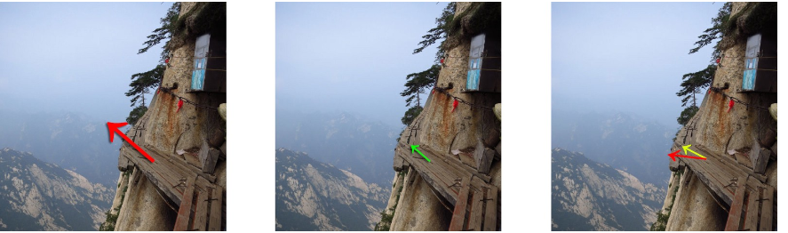
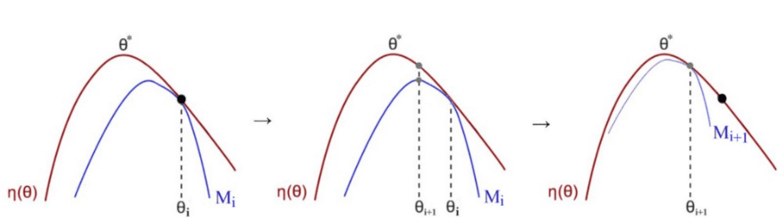

# Trust Region Policy Optimization

> 注意：为了友好显示latex公式，请大家自行加载google浏览器latex数学显示插件：[MathJax Plugin for Github点击进入下载页面](https://github.com/mathjax/MathJax/releases)

这篇文章是policy gradient方面很经典的一篇文章，作者是John Schulman, Sergey Levine, Philipp Moritz, Michael Jordan, Pieter Abbeel。

稍微多提一句，Michael Jordan是吴恩达的老师，是统计学派的领军人物。而Pieter Abbeel是吴恩达的徒弟。Sergey Levine是Abbeel的博后，John Schulman也是师从Abbeel。这里Abbeel的学生都是来自UCB的，他们大多和OpenAI有所交集。一作Schulman现在在领导OpenAI团队的Games Team。二作Levine目前在教UCB的cs294课程，质量很高。

从这里我们就可以看出，文章应该是一篇比较具有创新性并且foundational的工作，肯定会有不少理论推导和证明。

题外话说完了，接下来我来理一理这篇文章的思路由来以及发展。

## 背景

### 关于policy optimization（策略优化）

Policy optimization主要分为两个方面：

- Policy gradient methods （策略梯度方法）

- Derivative-free optimization methods （无梯度方法）

  ​	\- Cross Entropy Method（交叉熵方法）and Covariance Matrix Adaptation （ 自适应协方差矩阵）

其中我们在这里重点考虑的是策略梯度的方法，本文将要介绍的TRPO就是属于Policy Gradient的子算法。

### 关于Policy gradient

#### PG的优缺点

**优点**：

1. PG的方法可以应用于高维连续动作空间
2. 样本复杂性能够得到保证
3. 从理论上来讲policy-based比value-based可解释性更强一点

**缺点**：

1. 收敛到局部最优而不是全局最优（如果有bad samples 可能就会收敛到不好的地方）
2. 样本利用率低  
3. 策略评估效率低且方差大

因此我们要想办法克服其缺点，提高其表现能力。

#### 回顾Policy gradient

策略梯度如图所示，在该式子中，整体的策略梯度是找到最大reward对应的最陡峭的方向（即梯度最大方向），而后面的期望中告诉我们这个梯度是要sample一条trajectory得出来的。（个人理解：这里的trajectory是指从游戏开始到游戏结束的整条轨迹，而有时候提到的rollout是指trajectory中的某一小段）。

从这个公式中我们也能看出来policy gradient的一些问题：

1. 我们从策略中sample了一整条的轨迹只为了更新一次梯度，而不是在每个时间点上去更新梯度。如果我们假设一个轨迹有几百步这么多，当这些都用来更新一个策略的时候，稍微有一个地方出现偏差那么整个更新过程就会变得十分不稳定，这对于训练来说是十分不利的。

2. PG的方法假设其更新是平坦的，如果是在比较陡峭的地方可能就会产生比较差的结果。当一步更新过大时可能会导致灾难，更新过小又会导致学习过慢（如下图）。

   ​	

   ​	

    	如图所示，假设我们最开始处于黄点的位置，在这里地形比较平坦，因而我们要设置较大的学习率，以获得比较好的学习速度。但是假设有一个不太好的动作，我们就会从黄点跌落到红点。由于红点处的梯度很高，比较大的学习率可能会让策略向更低差的地方跌下去。因此实际上学习率对梯度的不敏感导致policy gradient的方法受到收敛问题的干扰。

### 记号

$Q_{\pi}\left(s_{t}, a_{t}\right)=\mathbb{E}_{s_{t+1}, a_{t+1}, \ldots}\left[\sum_{l=0}^{\infty} \gamma^{\prime} r\left(s_{t+l}\right)\right]$  

$V_{\pi}\left(s_{t}\right)=\mathbb{E}_{a_{t}, s_{t+1}, \cdots}\left[\sum_{l=0}^{\infty} \gamma^{\prime} r\left(s_{t+l}\right)\right]$ 

$\begin{aligned} A_{\pi}(s, a)=& Q_{\pi}(s, a)-V_{\pi}(s), \text { where } a_{t} \sim \pi\left(a_{t} | s_{t}\right) \\ s_{t+1} & \sim P\left(s_{t+1} | s_{t}, a_{t}\right) \text { for } t \geq 0 \end{aligned}$ 

$\begin{array}{l}{\eta(\pi)=\mathbb{E}_{s_{0}, a_{0}, \ldots}\left[\sum_{t=0}^{\infty} \gamma^{t} r\left(s_{t}\right)\right], \text { where }} \\ {s_{0} \sim \rho_{0}\left(s_{0}\right), a_{t} \sim \pi\left(a_{t} | s_{t}\right), s_{t+1} \sim P\left(s_{t+1} | s_{t}, a_{t}\right)}\end{array}$ 

$\rho_{\pi}(s)=P\left(s_{0}=s\right)+\gamma P\left(s_{1}=s\right)+\gamma^{2} P\left(s_{2}=s\right)+\dots$ 

其中，$A$ 是优势函数，即该动作相对于平均而言有多少额外reward。$\eta_\pi$ 是期望的折扣reward。$\rho_\pi$ 是加了折扣的state访问频率。

### 从记号出发

首先根据上面的记号，我们可以得出：

​			$\eta\left(\pi^{\prime}\right)=\eta(\pi)+E_{\pi^{\prime}}\left[\sum_{t=0}^{\infty} \gamma^{t} A_{\pi}\left(s_{t}, a_{t}\right)\right]​$ 

为什么这个式子是成立的呢？

1. 这里的$A_\pi$ 告诉我们做这个动作会给我们多少额外的reward
2. 将这个$A$ 按照时间加起来，告诉了我们这条轨迹上总的额外reward
3. 将这个轨迹的结果按照新的policy求期望，得到的就是平均额外的reward

需要注意的一点是这个公式告诉了我们不同策略下我们能够得到多少reward加成。而这个reward加成是按照轨迹来分析的，因为期望里面是按照时间顺序从0开始到正无穷的。由于我们之前分析了按照轨迹进行PG的样本利用率很低，因此我们需要将这个式子进行一定程度的变换。

### 展开分析

我们可以将上式改写为：

​			$ \begin{aligned} \eta\left(\pi^{\prime}\right) &=\eta(\pi)+\sum_{t=0} \sum_{s} P\left(s_{t}=s | \pi^{\prime}\right) \sum_{a} \pi^{\prime}(a | s) \gamma^{t} A_{\pi}(s, a) \\ &=\eta(\pi)+\sum_{s} \sum_{s}^{\infty} \gamma^{t} P\left(s_{t}=s | \pi^{\prime}\right) \sum_{a} \pi^{\prime}(a | s) A_{\pi}(s, a) \\ &=\eta(\pi)+\sum_{s} \rho_{\pi'}(s) \sum_{a} \pi^{\prime}(a | s) A_{\pi}(s, a) \end{aligned}$  

这里的第一行式子是将上面的式子的期望进行了展开，最后这里得到的结果是按照state来分析的，这明显就要比上面的按照轨迹分析要好一点。

那么我们现在可以分析一下这个式子，这个式子告诉了我们什么事情呢？

由于$\rho_{\pi'}$ 是代表访问频率的，这个是不可能小于0的，所以我们只要保证$ \sum_{a} \pi^{\prime}(a) A_{\pi}(s, a) \geq 0$ ，那么就可以得到$\sum_{s} \rho_{\pi^{\prime}}(s) \sum_{a} \pi^{\prime}(a | s) A_{\pi}(s, a) \geq 0$ 。也就是说$\eta\left(\pi^{\prime}\right) \geq \eta(\pi) $ ，我们新的策略一定不会比旧的策略差。 

但是这里也有一个缺点：在这个式子里，$\pi'$ 是我们的未知量，$\pi$ 是我们的已知量。而我们的右式中出现了$\rho_{\pi'}$ 和$\pi'$ 这两项。我们没有办法用未知的这两项去求我们的目标$\pi'$ ，因此这个式子实际上是无法应用的。

那么现在直接计算的路子已经堵死了，我们还能如何运用这个式子呢？没错，我们用近似的方法。

首先我们进行一定程度的假设，假设策略的改变不影响state的访问频率，即$\rho_{\pi^{\prime}}(s) \approx \rho_{\pi}(s)​$ 。

注意：**这里只是我们的一个假设，并不是他们真正相等**

那么我们就可以得到：

​			$\eta\left(\pi^{\prime}\right) \approx \eta(\pi)+\sum_{s} \rho_{\pi}(s) \sum_{a} \pi^{\prime}(a) A_{\pi}(s, a)$ 

重写一下这个式子：

​			$\Delta_{\eta}=\eta\left(\pi^{\prime}\right)-\eta(\pi) \approx \sum_{s} \rho_{\pi}(s) \sum_{a} \pi(a) *\left[\frac{\pi^{\prime}(a)}{\pi(a)} A^{\pi}(s, a)\right]$ 

我们会得到这样形式的一个表达式。为什么这个式子对我们有用，要比上面的好呢？

1. 这里的$\sum_{s} \rho_{\pi}(s) \sum_{a} \pi(a)$ 是在旧的policy下的样本
2. $A^{\pi}(s, a)$ 是旧的policy下的优势函数
3. $\frac{\pi^{\prime}(a)}{\pi(a)}$ 我们可以用important sampling的思想来做

因此这个式子就变成了可以使用的了。

记住，这个式子可用的前提是$\rho_{\pi^{\prime}}(s) \approx \rho_{\pi}(s)$ 。那么这个条件到底是否成立呢？我们需要验证一下：

首先让$\pi^{\prime}(a)=\pi(a)+\Delta \pi_{a}$ ，接下来我们可以得到：

​			$ \sum_{a} \pi^{\prime}(a) A_{\pi}(s, a)=\sum_{a} \pi(a) A_{\pi}(s, a)+\sum_{a} \Delta \pi_{a} A_{\pi}(s, a)$ ，

在这里面，根据记号来说，$A_{\pi}(s, a)=Q_{\pi}(s, a)-V_{\pi}(s)$ ，因此$\sum_{a} \pi(a) A_{\pi}(s, a)=\sum_{a} \pi(a)\left(Q_{\pi}(s, a)-V_{\pi}(s)\right)=\sum_{a}\left(V_{\pi}(s)-V_{\pi}(s)\right)=0$ 

​	所以，   $\sum_{a} \pi^{\prime}(a) A_{\pi}(s, a)=0+\sum_{a} \Delta \pi_{a} A_{\pi}(s, a)$ 

再让$\rho_{\pi^{\prime}}(s)=\rho_{\pi}(s)+\Delta \rho$ ，我们就可以得到：

​			$\Delta \eta=\sum_{s}\left(\rho_{\pi}(s)+\Delta \rho\right)\left(\sum_{a} \Delta \pi_{a} A_{\pi}(s, a)\right)$ 

​			$\Delta \eta=\sum_{s} \rho_{\pi}(s)\left(\sum_{a} \Delta \pi_{a} A_{\pi}(s, a)\right)+\sum_{s} \Delta \rho\left(\sum_{a} \Delta \pi_{a} A_{\pi}(s, a)\right)$ 

这里的第一项就是我们想要的，第二项我们可以看出是一个二阶的项。那么我们能否忽略或者近似第二项呢？

### Conservative Greedy Algorithm

首先要说明的是，TRPO的整篇工作都是基于Kakade在2002年ICML上的论文《Approximately Optimal Approximate Reinforcement Learning》的工作进一步发展而来的，因此Kakade提出的这个方法是理解TRPO的关键。

我们刚才说到了$\Delta\eta​$ 中的第二项要想办法近似或者忽略，这篇论文中就提出了一个方案：

​			$\eta\left(\pi_{n e w}\right)-\eta(\pi) \geq A_{\pi}\left(\pi_{n e w}\right)-\frac{2 \epsilon \gamma}{(1-\gamma)} \alpha^{2}$ ，其中，

​						$\pi_{n e w}=(1-\alpha) \pi+\alpha \pi^{\prime}​$ 

​						$\epsilon=\frac{1}{1-\gamma}\left(\max _{s} \sum_{a} \pi^{\prime}(s, a) A^{\pi}(s, a)\right)$ 

​						$A_{\pi}\left(\pi^{n e w}\right) :=\sum_{s} \rho_{\pi}(s) \sum_{a} \pi^{n e w}(s, a) A^{\pi}(s, a)$ 

注意这里关于策略有三个不同的量：$\pi​$，$\pi'​$ 和$\pi_{new}​$  。其中$\pi_{new}​$是根据前两个计算而来。这里的$\alpha​$ 和$\pi'​$ 都是可以通过计算得到的值。

这个式子就告诉了我们当$\pi_{new}$ 的更新符合$\pi_{n e w}=(1-\alpha) \pi+\alpha \pi^{\prime}$ 的时候，我们策略的更新是有保障的提高的。整个论文的算法流程如下图：

但是该算法仍然有一些问题，比如这里$\alpha$ 计算起来比较困难，而且该算法只能保证$\pi_{new}$ 在其更新公式下更新才能有保证。也就是说每次我们在更新策略的时候都要先计算好对应的$\alpha$，然后才能得到保证单调变好的策略。这其实并不利于应用，我们想要更加通用的方法来解决policy的问题，用一种不需要$\alpha$ 的方式。

### TRPO

于是针对于Kakade提出来的公式，TRPO进行了一定程度的改进：

​			$\eta\left(\pi_{\text { new }}\right) \geq L_{\pi_{\text { ald }}}\left(\pi_{\text { new }}\right)-\frac{4 e \gamma}{(1-\gamma)^{2}} \alpha^{2}​$ ，其中，

​					$\epsilon=\max _{s, a}\left|A_{\pi}(s, a)\right|​$ 

​					$L_{\pi}\left(\pi_{n e w}\right)=\eta(\pi)+\sum_{s} \rho_{\pi}(s) \sum_{a} \pi_{n e w}(a | s) A_{\pi}(s, a)​$ 

​					$P\left(a \neq a_{\text { new }} | s\right) \leq \alpha​$ 

对比一下两个公式就可以发现，在该式中，我们将$\pi'$ 去掉了，也就是说任意$\pi_{new}$ 都是可以保证满足这个不等式的。而这里的$\alpha$与上面的定义也有所不同。具体该式的证明过程可以在论文附录中找到，与Kakade2002中证明过程基本相同。

这个式子主要的贡献就是我们不需要再混合着$\alpha$ 才能求$\pi_{new}$ 了，在这种情况下我们一样得到了一个能够保证不断提高的策略。

接下来就是我们如何一步一步将这个式子进行近似，进行分析，将他能够利用神经网络来得到解的过程。

### TRPO的深入

#### KL散度

在上面的式子中，$\alpha$ 参数的含义是$P\left(a \neq a_{\text { new }} | s\right) \leq \alpha$ ，这里实际上说明了$\alpha$ 代表的是total variation divergence，即总变化距离。在这里，我们用最大变化距离来代替总变化距离：

​			$D_{\mathrm{TV}}^{\max }(\pi, \overline{\pi})=\max _{s} D_{T V}(\pi(\cdot | s) \| \tilde{\pi}(\cdot | s))$ ，其中 $D_{T V}(p \| q)=\frac{1}{2} \sum_{i}\left|p_{i}-q_{i}\right|$ 

 在[Pollard,2000]中证明了$D_{KL} \geq D_{TV}^2$ ，我在TRPO的reference中找到的该文链接已经挂了，所以找到了额外的两个pdf中分别给予了不同的证明： [链接1](http://people.seas.harvard.edu/~madhusudan/courses/Spring2016/scribe/lect07.pdf) 中的第4页和[链接2](http://www.stat.yale.edu/~pollard/Courses/607.spring05/handouts/Totalvar.pdf)中的problem 8 。

由于我们用最大变化距离代替了总的变化距离，因此这里我们也应当用最大的KL散度：

​			$D_{\mathrm{KL}}^{\max }(\pi, \tilde{\pi})=\max _{s} D_{\mathrm{KL}}(\pi(\cdot | s) \| \tilde{\pi}(\cdot | s))$ 

这样我们就可以将之前的式子改写成：

​			$\begin{array}{r}{\eta(\tilde{\pi}) \geq L_{\pi}(\tilde{\pi})-C D_{\mathrm{KL}}^{\max }(\pi, \tilde{\pi})}\end{array}$ ，其中 $C=\frac{4 \epsilon \gamma}{(1-\gamma)^{2}}$ 

#### MM算法

让$M_{i}(\pi)=L_{\pi_{i}}(\pi)-C D_{\mathrm{KL}}^{\max }\left(\pi_{i}, \pi\right)$ ，然后将这个式子再重写一下，我们得到：

​			$\eta\left(\pi_{i+1}\right)-\eta\left(\pi_{i}\right) \geq M_{i}\left(\pi_{i+1}\right)-M\left(\pi_{i}\right)$ 

我们分析得到的式子可以发现，在$\pi_i$ 确定的情况下，$\eta(\pi_i)$ 和$M(\pi_i)$ 就确定了，那么只要我们增大$M_i(\pi_{i+1})$ ，就相当于优化了$\eta(\pi_{i+1})​$ 。这实际上就是利用了MM算法，我们在无法优化目标函数的情况下，转而优化其下界，他的下界提高的时候，目标函数也就得到了提高。

#### 置信域

现在我们有了明确的优化目标，我们想要得到：

​			$\max _{\pi_{i}}\left(\mathcal{L}_{\pi}\left(\pi_{i}\right)-C D_{K L}^{\max }\left(\pi_{i}, \pi\right)\right)​$ 

在实际优化过程中，我们会发现这个式子会有个问题：当$\gamma$ （折扣因子）越接近于1的时候，这里的$C$ 会变的越大，相对应的梯度就会变得越小。一个比较好的方案是把这里的$C$ 当做超参数来处理，但是$C$ 又不能是一个固定不变的超参数，而应该是一个adaptive的值。这就导致调节这个超参数比较复杂。因此我们需要一个替代方案。

我们可以发现，原式是一个加$KL$散度做惩罚的优化问题，可以通过拉格朗日对偶转化为一个约束$KL$散度的优化问题。即转化为：

​			$\begin{array}{l}{\max _{\pi_{i}} \mathcal{L}_{\pi}\left(\pi_{i}\right)} , {\text { s.t. } D_{K L}^{\max }\left(\pi_{i}, \pi\right) \leq \delta}\end{array}$ 

这里的$\delta$ 也是一个超参数，不过这个超参数就要比刚才的$C$ 好调节的多了。

#### 平均$KL$ 散度

注意，上式中虽然问题得到了简化，但是约束条件中是要让最大的$KL$ 小于一个超参数，求最大$KL$ 的时候就肯定会把每一对都计算一遍，这个计算复杂度就要高很多。那么我们想用近似替代的方案，把最大$KL$ 用平均$KL$ 替代：

​			$\overline{D}_{\mathrm{KL}}^{\rho}\left(\theta_{1}, \theta_{2}\right) :=\mathbb{E}_{s \sim \rho}\left[D_{\mathrm{KL}}\left(\pi_{\theta_{1}}(\cdot | s) \| \pi_{\theta_{2}}(\cdot | s)\right)\right]$ 

这样我们只要保证从$\rho$ 中sample出来的state的$KL$ 散度都是满足条件的，那么我们就认为最大$KL$ 也是满足条件的。

#### 重要性采样

这里的重要性采样已经在上文提过了，就是将

​			$\begin{array}{l}{\text { maximize } L_{\theta_{\text { old }}(\theta)}}, {\text { subject to } \overline{D}_{\mathrm{KL}}^{\rho_{\theta_{\text { old }}}}\left(\theta_{\text { old }}, \theta\right) \leq \delta}\end{array}$ 

转化为

​			$\begin{array}{l}{\text { maximize } \mathbb{E}_{s \sim \rho_{\text { old }}, a \sim \pi_{\text { old }}}\left[\frac{\pi_{\theta}(a | s)}{\pi_{\theta_{\text { old }}}(a | s)} Q_{\theta_{\text { old }}}(s, a)\right]} , {\text { subject to } \mathbb{E}_{s \sim \rho_{\text { old }}}\left[D_{K L}\left(\pi_{\theta_{\text { old }}}(\cdot | s) \| \pi_{\theta}(\cdot | s)\right)\right] \leq \delta}\end{array}$ 

即将所有我们需要用到的地方都用sample的形式表达出来。

#### 计算梯度

现在目标公式已经很清晰了，接下来就是我们应该如何去优化它，计算其梯度。

首先我们将上式进行泰勒展开，展开到二阶的形式：

	

将等于0的项去掉，我们就可以得到：

​			$\mathcal{L}_{\theta_{k}}(\theta) \approx g^{T}\left(\theta-\theta_{k}\right)$ ，其中 $g \doteq \nabla_{\theta} \mathcal{L}_{\theta_{k}}\left.(\theta)\right|_{\theta_{k}}$ 

​			$\overline{D}_{K L}(\theta \| \theta_{k}) \approx \frac{1}{2}\left(\theta-\theta_{k}\right)^{T} H\left(\theta-\theta_{k}\right)$ ，其中 $H \doteq \nabla_{\theta}^{2} \overline{D}_{K L}\left.(\theta \| \theta_{k})\right|_{\theta_{k}}$ 

所以原式从：

​			$ \pi_{k+1}= \arg \max _{\pi^{\prime}} \mathcal{L}_{\pi_{k}}\left(\pi^{\prime}\right), \text { s.t. } \overline{D}_{K L}\left(\pi^{\prime} \| \pi_{k}\right)  \leq \delta $ 

转变为：

​			$\begin{array}{l}{\theta_{k+1}=\arg \max _{\theta} g^{T}\left(\theta-\theta_{k}\right)}, {\text { s.t. } \frac{1}{2}\left(\theta-\theta_{k}\right)^{T} H\left(\theta-\theta_{k}\right) \leq \delta}\end{array}$ 

这里同时告诉了我们是如何从策略空间转移到参数空间的。

注意，这里的$H$ 就是两种$\theta$ 之间的$KL$ 的二阶导数。实际上这个$H$ 也被称为Fisher Information Matrix。举个例子，比如在欧式空间中，我们常用的有笛卡尔坐标系和极坐标系。距离分别是用

​			$d=\sqrt{\left(x_{2}-x_{1}\right)^{2}+\left(y_{2}-y_{1}\right)^{2}}$ 和 $d=\sqrt{r_{1}^{2}+r_{2}^{2}-2 r_{1} r_{2} \cos \left(\theta_{1}-\theta_{2}\right)}$ 

来计算的。这是因为我们平时都假设空间是平坦的。但是如果空间非平坦，那么实际上距离的计算应该为：

​			$d=\Delta \mathrm{w}^{\mathrm{T}} \mathrm{G}_{\mathrm{w}} \Delta \mathrm{w}$ 

来计算。而这里的$G$就相当于一个FIM。对应到笛卡尔坐标系和极坐标系，距离则分别为：

​			$d=\left( \begin{array}{ll}{\delta \mathbf{x}} & {\delta \mathbf{y}}\end{array}\right) \left( \begin{array}{ll}{1} & {0} \\ {0} & {1}\end{array}\right) \left( \begin{array}{l}{\delta \mathbf{x}} \\ {\delta \mathbf{y}}\end{array}\right)$  和$d=\left( \begin{array}{ll}{\delta r} & {\delta \theta}\end{array}\right) \left( \begin{array}{ll}{1} & {0} \\ {0} & {r}\end{array}\right) \left( \begin{array}{l}{\delta r} \\ {\delta \theta}\end{array}\right)$ 

这个公式也说明了距离是可以通过这个公式以任一坐标系下的对应计算得到，而不同坐标系也就对应了不同的$G$。从这里我们也可以发现，其实我们的约束条件$\frac{1}{2}\left(\theta-\theta_{k}\right)^{T} H\left(\theta-\theta_{k}\right) \leq \delta$ ，实际上就相当于约束了策略之间的距离要小于一个值。这里的$G$ 也就相当于衡量了策略对于模型参数$\theta$ 的敏感程度。客观上说明了策略梯度的算法具有模型不变性。

#### 共轭梯度法

得到了我们的参数空间下的目标函数后，可以通过数学推导得出解析式：

​			$\theta_{k+1}=\theta_{k}+\sqrt{\frac{2 \delta}{g^{T} H^{-1} g}} {H^{-1} g}$ 

虽然我们可以求得这里的矩阵$H$，但是在式中我们还要求$H^{-1}$ ，这个相对来说是一个比较难以求解。TRPO提供的思路是将$H^{-1}g$ 整体进行计算。令

​			$x_{k} \approx \hat{H}_{k}^{-1} \hat{g}_{k}$ ，那么 $\hat{H}_{k} x_{k} \approx \hat{g}$ 

我们可以发现实际上要解的问题就变成了求$A x=b$ 中$x$ 的问题。这相当于

​			$f(x)=\frac{1}{2} x^{T} A x-b^{T} x$ ，因为其$f^{\prime}(x)=A x-b=0$ 

这个问题往往用共轭梯度（Conjugate Gradient）的方法进行求解，具体的关于CG的相关内容可以见[链接](https://medium.com/@jonathan_hui/rl-conjugate-gradient-5a644459137a) 中。

### TRPO最终算法

最后我们得到了最终的整个算法流程：

### TRPO的一些限制

- 在TRPO算法中忽略了关于advantage函数的评价方法的error
- 由于有矩阵$H$ 的存在，TRPO很难使用一阶的优化方法

### PPO

现在我们知道，整个TRPO算法中，最复杂的部分就是$\max _{\pi_{i}}\left(\mathcal{L}_{\pi}\left(\pi_{i}\right)-C D_{K L}^{\max }\left(\pi_{i}, \pi\right)\right)$ 的目标函数中$C$ 难以设置。而PPO的一个改进版本就是将$C$ 设置成了一个自适应的超参数，从而简化了目标函数的优化过程。

关于PPO的部分可以参照[链接](https://medium.com/@jonathan_hui/rl-proximal-policy-optimization-ppo-explained-77f014ec3f12)

### 引用

除了几个链接的引用之外，还用到了如下的一些资料：

[1] RL — Trust Region Policy Optimization (TRPO) Explained. <https://medium.com/@jonathan_hui/rl-trust-region-policy-optimization-trpo-explained-a6ee04eeeee9> 

[2] Overview of the TRPO RL paper/algorithm. <https://www.youtube.com/watch?v=xUOQMvR0T6Q&t=458s> 

[3] Lecture 7: Approximately optimal approximate RL, TRPO. <https://github.com/ieor8100/rl/blob/master/docs/Lecture%207%20-Approximate%20RL.pdf> 

[4] Trust Region Policy Optimization.<https://arxiv.org/abs/1502.05477> 

[5] Approximately Optimal Approximate Reinforcement Learning. <https://people.eecs.berkeley.edu/~pabbeel/cs287-fa09/readings/KakadeLangford-icml2002.pdf> 

[6] Lecture 14 Natural Policy Gradients, TRPO, PPO, ACKTR. <https://www.youtube.com/watch?v=yqYKeWtUSO8&list=PLpIxOj-HnDsNfvOwRKLsUobmnF2J1l5oV&index=14> 

[7] Natural Policy Gradients, TRPO, PPO. <https://www.youtube.com/watch?v=xvRrgxcpaHY&list=PLPfj7W0fIrmy3MfjPFbpy7jFGDmvspgHE&index=6> 
