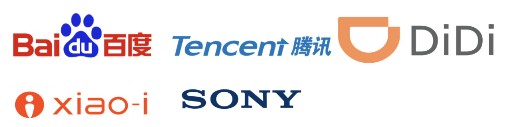

## IJCAI会议
### 关于IJCAI
**International Joint Conferences on Artificial Intelligence（IJCAI）** is a non-profit corporation founded in California, in 1969 for scientific and educational purposes, including dissemination of information on Artificial Intelligence at conferences in which cutting-edge scientific results are presented and through dissemination of materials presented at these meetings in form of Proceedings, books, video recordings, and other educational materials. IJCAI consists of two divisions: the Conference Division and the AI Journal Division. IJCAI conferences present premier international gatherings of AI researchers and practitioners and they were held biennially in odd-numbered years since 1969.

Starting with 2016, IJCAI conferences are held annually. IJCAI-PRICAI-20 will be held in Yokohama, Japan, IJCAI-21 in Montreal, Canada, IJCAI-ECAI-22 in Bologna, Italy and IJCAI-23 in Cape Town, South Africa.

IJCAI is governed by the Board of Trustees, with IJCAI Secretariat in charge of its operations.

 IJCAI-19 was be held in Macao, P.R. China from August 10-16, 2019. The IJCAI Organization and Local Arrangements Committee thank you for participating.
### 官网：https://www.ijcai.org/

### 赞助商

