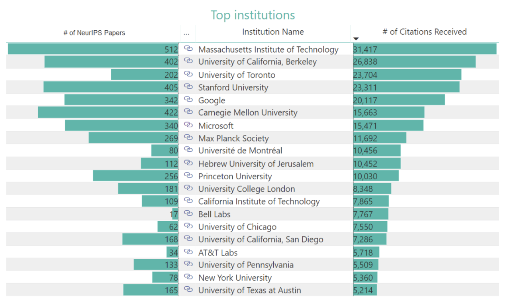
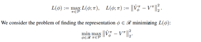
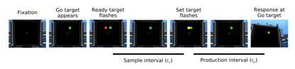
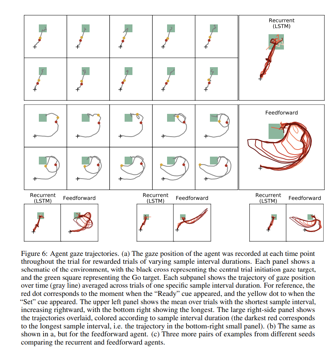
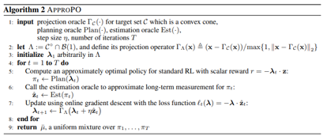
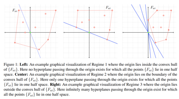

# NIPS2019会议 -- **61篇深度强化学习汇总**

NeurIPS（前称NIPS）可谓人工智能年度最大盛会。每年圣诞前夕，全球的人工智能爱好者和科学家都会在这里聚集，发布最新研究，并进行热烈探讨。这不仅是一次大的party，也是一次重要的技术发展指向，大会的技术往往这未来几年就会演变成真正的研究甚至应用成果。今年的大会将在12月8日-14日在加拿大温哥华举行，据官方消息，NeurIPS今年共收到投稿6743篇，再次打破了历年来的接收记录。今年接收论文1429篇，其中，Oral论文36篇，占比0.5%；Spotlight论文接收量为164篇，占比2.4%。

今年NeurIPS接受的论文中，接收论文数量最多的机构还是**Google，共179篇**，其中**Deepmind参与的有53篇**，Google/Google Brain/Google Research有126篇，远远超出了其他家：Facebook上榜39篇，NVIDIA上榜9篇。高校方面：斯坦福上榜79篇，MIT上榜77篇，卡耐基梅隆上榜75篇。国内，高校方面清华参与的共有35篇，北大26篇，中科大7篇，西安交通大学5篇，还有大连理工也有2篇论文被收录。国内企业投稿也很多，腾讯上榜18篇，阿里巴巴上榜10篇，百度5篇，而最近准备赴港上市的旷视也上榜两篇。

而从论文题目来看
+ **强化学习61篇，占比：4.2%**
+ >理论大约（21）篇
强化学习技巧（3）篇
框架大约（3）篇
探索和利用（1）篇
元强化学习（4）篇
分层强化学习（2）篇+
逆强化学习（2）篇
多智能体（6）篇
奖励函数（2）篇
应用（6）篇
其他（4）篇
+ GANs出现在了22篇论文中
+ meta-learning的则有8篇。

---
> 内容总共分为两部分：
> + 第一部分：论文标题与链接
> + 第二部分：论文详细解读

# 第一部分：论文标题与链接

---
### 理论

+ Multi-View Reinforcement Learning

+ Sample-Efficient Deep Reinforcement Learning via Episodic Backward Update
https://arxiv.org/pdf/1805.12375.pdf

+ Information-Theoretic Confidence Bounds for Reinforcement Learning

+ Regret Minimization for Reinforcement Learning by Evaluating the Optimal Bias Function
https://arxiv.org/pdf/1906.05110.pdf

+ Real-Time Reinforcement Learning
+ Convergent Policy Optimization for Safe Reinforcement Learning

+ Intrinsically Efficient, Stable, and Bounded Off-Policy Evaluation for Reinforcement Learning
https://arxiv.org/pdf/1906.03735.pdf

+ Propagating Uncertainty in Reinforcement Learning via Wasserstein Barycenters

+ A Geometric Perspective on Optimal Representations for Reinforcement Learning
https://arxiv.org/pdf/1901.11530.pdf

+ Finite-Time Performance Bounds and Adaptive Learning Rate Selection for Two Time-Scale Reinforcement Learning
https://arxiv.org/pdf/1907.06290.pdf

+ Interval Timing in Deep Reinforcement Learning Agents
https://arxiv.org/pdf/1905.13469v1.pdf

+ Non-Stationary Markov Decision Processes, a Worst-Case Approach using Model-Based Reinforcement Learning
https://arxiv.org/pdf/1904.10090.pdf

+ Budgeted Reinforcement Learning in Continuous State Space
http://ncarrara.fr/others/ncarrara_budgeted_rl.pdf

+ Marginalized Off-Policy Evaluation for Reinforcement Learning
https://tengyangxie.github.io/papers/xie2018nips_cl.pdf

+ Regularized Anderson Acceleration for Off-Policy Deep Reinforcement Learning

+ Tight Regret Bounds for Model-Based Reinforcement Learning with Greedy Policies
https://arxiv.org/pdf/1905.11527.pdf

+ Regret Bounds for Learning State Representations in Reinforcement Learning

+ Reinforcement Learning with Convex Constraints
https://arxiv.org/pdf/1906.09323.pdf

+ Correlation Priors for Reinforcement Learning
+ Policy Poisoning in Batch Reinforcement Learning and Control

+ Imitation-Projected Policy Gradient for Programmatic Reinforcement Learning
https://arxiv.org/pdf/1907.05431.pdf

### 强化学习技巧

+ The Option Keyboard: Combining Skills in Reinforcement Learning

+ When to use parametric models in reinforcement learning?
https://arxiv.org/pdf/1906.05243.pdf

+ Robust exploration in linear quadratic reinforcement learning 
https://arxiv.org/pdf/1906.01584.pdf

### 框架

+ A Regularized Approach to Sparse Optimal Policy in Reinforcement Learning
http://export.arxiv.org/pdf/1903.00725

+ A Variational Inference Framework for Reinforcement Learning
https://arxiv.org/pdf/1811.01132.pdf

+ Gossip-based Actor-Learner Architectures for Deep Reinforcement Learning
https://arxiv.org/pdf/1906.04585.pdf

### 探索和利用

+ Explicit Planning for Efficient Exploration in Reinforcement Learning

### 元强化学习

+ A Meta-MDP Approach to Exploration for Lifelong Reinforcement Learning
https://people.cs.umass.edu/~fmgarcia/Papers/MetaMDP_Paper.pdf

+ SMILe: Scalable Meta Inverse Reinforcement Learning through Context-Conditional Policies

+ Unsupervised Curricula for Visual Meta-Reinforcement Learning
https://arxiv.org/pdf/1806.04640.pdf

+ Meta-Inverse Reinforcement Learning with Probabilistic Context Variables

### 分层强化学习

+ Hierarchical Reinforcement Learning with Advantage-Based Auxiliary Rewards

+ Language as an Abstraction for Hierarchical Deep Reinforcement Learning(Google)
https://arxiv.org/pdf/1906.07343.pdf

### 逆强化学习

+ Learner-aware Teaching: Inverse Reinforcement Learning with Preferences and Constraints
https://arxiv.org/pdf/1906.00429.pdf

+ On the Correctness and Sample Complexity of Inverse Reinforcement Learning
https://arxiv.org/pdf/1906.00422.pdf

### 多智能体

+ Regret Minimization for Reinforcement Learning on Multi-Objective Online Markov Decision Processes

+ Value Propagation for Decentralized Networked Deep Multi-agent Reinforcement Learning
https://arxiv.org/abs/1901.09326

+ Efficient Communication in Multi-Agent Reinforcement Learning via Variance Based Control

+ LIIR: Learning Individual Intrinsic Reward in Multi-Agent Reinforcement Learning

+ A Structured Prediction Approach for Generalization in Cooperative Multi-Agent Reinforcement Learning

+ Multi-Agent Common Knowledge Reinforcement Learning
https://arxiv.org/pdf/1810.11702.pdf

### 奖励函数

+ Distributional Reward Decomposition for Reinforcement Learning

+ Learning Reward Machines for Partially Observable Reinforcement Learning

### 应用

+ Staying up to Date with Online Content Changes Using Reinforcement Learning for Scheduling
https://openreview.net/pdf?id=ByxjGvuKoE

+ Loaded DiCE: Trading off Bias and Variance in Any-Order Score Function Gradient Estimators for Reinforcement Learning

+ InteractiveRecGAN: a Model Based Reinforcement Learning Method with Adversarial Training for Online Recommendation

+ A Composable Specification Language for Reinforcement Learning Tasks

+ Near-Optimal Reinforcement Learning in Dynamic Treatment Regimes

+ Constraint Augmented Reinforcement Learning for Text-based Recommendation and Generation

### 其他

+ Generalization in Reinforcement Learning with Selective Noise Injection and Information Bottleneck

+ Using a Logarithmic Mapping to Enable Lower Discount Factors in Reinforcement Learning

+ Search on the Replay Buffer: Bridging Planning and Reinforcement Learning

+ A Family of Robust Stochastic Operators for Reinforcement Learning
---

# 第二部分：论文详细解读

理论方法
+ **Multi-View Reinforcement Learning(UCL出的论文，很遗憾没找到paper)**
+ **Sample-Efficient Deep Reinforcement Learning via Episodic Backward Update**
> 该文章提出了一种具有直接值传播的新型深度强化学习算法Episodic Backward Update（EBU）。它的代理对整个事件进行采样并且连续地将状态的值传播到其先前的状态。通过计算效率高的递归算法允许稀疏和延迟奖励直接传播到采样情节的所有转换中。 作者在理论上证明了EBU方法的收敛性，并在确定性和随机环境中实验证明了它的性能。 特别是在Atari 2600域的49场比赛中，EBU分别仅使用5％和10％的样本，达到了相同的DQN均值和中值人归一化性能。

+ **Information-Theoretic Confidence Bounds for Reinforcement Learning(强化学习的信息理论置信度)**

+ **Regret Minimization for Reinforcement Learning by Evaluating the Optimal Bias Function**
> 该论文提出了一种基于面对不确定性（OFU）原理的算法，该算法能够有效地学习具有有限状态作用空间的马尔可夫决策过程（MDP）建模的强化学习（RL）,其通过评估最优偏差函数的状态对差异，在h*跨度的上限H的情况下，提出的算法实现了具有S状态和A动作的MDP的后悔界限，其边界如下。【这是清华大学出的一篇包含大量数学证明的论文】。

+ **Real-Time Reinforcement Learning(实时强化学习)**

+ **Convergent Policy Optimization for Safe Reinforcement Learning**

+ **Intrinsically Efficient, Stable, and Bounded Off-Policy Evaluation for Reinforcement Learning**
> 在非策略评估（OPE）中允许人们在不需要进行探索的情况下评估新颖的决策政策，这通常是昂贵的或不可行的。该问题的重要性吸引了许多提出的解决方案，包括重要性抽样（IS），自标准化IS（SNIS）和双重鲁棒（DR）估计。作者基于经验似然提出了新的OPE估计，这些估计总是比IS，SNIS和DR更有效，并且满足与SNIS相同的稳定性和有界性。通过它们对现有的估算器进行分类，除了理论上的保证外，实证研究表明新的估算器具有优势。

+ **Propagating Uncertainty in Reinforcement Learning via Wasserstein Barycenters**

+ **A Geometric Perspective on Optimal Representations for Reinforcement Learning（★★★★，推荐看）**
> 本文是一篇由DeepMind, GoogleBrain,牛津大学等共同发表的文章，作者基于价值函数空间的几何性质，提出了强化学习中表征学习的新视角。其利用这种观点提供关于价值函数作为辅助任务的有用性的正式证据。 并表述考虑调整表示以最小化给定环境的所有固定策略的值函数的（线性）近似，这种优化减少了对一类特殊值函数的准确预测，他们将其称为对抗值函数（AVF）。 结果证明使用值函数作为辅助任务对应于我公式的预期误差放宽，AVF是一个自然的候选者，并确定与原始值函数的密切关系（Mahadevan，2005）。 其强调了AVF的特征及其在四室域系列实验中作为辅助任务的实用性。

+ **Finite-Time Performance Bounds and Adaptive Learning Rate Selection for Two Time-Scale Reinforcement Learning**
>作者研究了两种时间尺度的线性随机近似算法，可用于模拟众所周知的强化学习算法，如GTD，GTD2和TDC。 其给出了学习率固定的情况下的有限时间性能界限，并获得这些界限的关键思想是使用由奇异摄动理论驱动的线性微分方程的Lyapunov函数（Lyapunov function motivated by singular perturbation theory for linear differential equations）。 并使用边界来设计自适应学习速率方案，该方案在实验中显着提高了已知最优多项式衰减规则的收敛速度，并且可用于潜在地改善学习速率在前期改变的任何其他时间表的性能。 确定的时间瞬间。

+ **Interval timing in deep reinforcement learning agents（DeepMind）**
> 作者认为时间的测量是智能行为的核心。一般知道动物和人工代理都可以成功地使用时间依赖来选择动作。在人工智能体中，很少有工作直接解决（1）哪些架构组件是成功开发此能力所必需的，（2）如何在代理的单元和动作中表示这种时序能力，以及（3）是否系统的最终行为会集中在类似于生物学的解决方案上。在这里，我们研究了深度强化学习智能体的区间定时能力，这些代理能力是在间隔再生范式上进行端到端训练，这种范式受到关于时间机制的实验文献的启发。并描述了由经常性和前馈性代理人开发的策略，这些策略都使用不同的机制在时间再生上取得成功，其中一些机制与生物系统具有特定且有趣的相似性。这些发现推动了我们对代理人如何代表时间的理解，并突出了实验启发的方法来表征代理人能力的价值。

+ **Non-Stationary Markov Decision Processes, a Worst-Case Approach using Model-Based Reinforcement Learning**
> 这项工作解决了非平稳随机环境中强大的零射击规划问题。作者研究马尔可夫决策过程（MDP）随时间演变并在此设置中考虑基于模型的强化学习算法。提出两个假设：1）环境以有限的进化速率不断演变; 2）当前模型在每个决策时期都是已知的，但不是它的演化。我们的贡献可以分为四点。 1）定义了一类特定的MDP，称之为非固定MDP（NSMDP）。作者通过对过渡和奖励函数w.r.t做出Lipschitz-Continuity的假设来介绍常规进化的概念。时间; 2）考虑使用当前环境模型但未意识到其未来发展的计划代理。这导致我们考虑一种最坏情况的方法，其中环境被视为对抗剂; 3）遵循这种方法，最后作者提出风险反向树搜索（RATS）算法，一种类似于Minimax搜索的基于模型的零射击方法; 4）通过经验证明了RATS带来的好处，并将其性能与基于模型的参考算法进行了比较。

+ **Budgeted Reinforcement Learning in Continuous State Space**
> 预算马尔可夫决策过程（BMDP）是马尔可夫决策过程对需要安全约束的关键应用的扩展。 它依赖于以成本信号的形式实施的风险概念，该成本信号被限制在低于-可调-阈值。 到目前为止，BMDP只能在具有已知动态的有限状态空间的情况下求解。 这项工作将最先进的技术扩展到连续的空间环境和未知的动态。 作者证明了BMDP的解决方案是一个新的预算贝尔曼最优性算子的固定点。 这一观察结果使我们能够引入Deep Reinforcement Learning算法的自然扩展来解决大规模BMDP问题，并在口语对话和自动驾驶两个模拟应用上验证了方法：

+ **Marginalized Off-Policy Evaluation for Reinforcement Learning**
> 非策略评估涉及使用不同行为政策获得的历史数据评估政策的绩效。 在强化学习的现实应用中，策略政策可能成本高昂且危险，而策略外评估通常是关键步骤。 目前，离线策略评估的现有方法主要基于离散树MDP的马尔可夫决策过程（MDP）模型，并且由于重要性权重的累积乘积而具有高方差。 在本文中，作者直接基于离散有向无环图（DAG）MDP提出了一种新的非策略评估方法。方法可以应用于大多数非策略评估的估算，无需修改，可以显着减少差异。 作者还对方法进行了理论分析，并通过实证结果对其进行了评估。

+ **Regularized Anderson Acceleration for Off-Policy Deep Reinforcement Learning**

+ **Tight Regret Bounds for Model-Based Reinforcement Learning with Greedy Policies**
> 最先进的基于模型的有效强化学习（RL）算法通常通过迭代求解经验模型来行动，即，通过对所收集的经验构建的马尔可夫决策过程（MDP）执行完全规划。在本文中，作者关注有限状态有限时间MDP设置中基于模型的RL，并建立用贪婪策略进行探索 - 通过one-step planning行动,可以实现紧密的极小极大表现为reget。因此，可以完全避免基于模型的RL中的完全规划而不会降低性能，并且通过这样做，计算复杂度降低了S因子。结果基于对实时动态编程的新颖分析，然后扩展到基于模型的RL。具体而言，作者概括了执行完整计划的现有算法，以便通过一步规划来实现。对于这些概括，最后以与其全规划对应方相同的速率证明了后悔。

+ **Regret Bounds for Learning State Representations in Reinforcement Learning**

+ **Reinforcement Learning with Convex Constraints （普林斯顿、微软）**
>在标准强化学习（RL）中，学习智能体寻求优化整体奖励。然而，期望行为的许多关键方面更自然地表达为约束。例如，设计者可能想要限制不安全动作的使用，增加轨迹的多样性以实现探索，或者在奖励稀疏时近似专家轨迹。在本文中，作者提出了一种算法方案，可以处理RL任务中的一大类约束：具体而言，任何需要某些向量测量的期望值（例如使用动作）的约束都位于凸集中。这捕获了先前研究的约束（例如安全性和与专家的接近度），但也实现了新的约束类（例如多样性）。作者的方法具有严格的理论保证，并且仅依赖于近似解决标准RL任务的能力。因此，它可以很容易地适用于任何无模型或基于模型的RL。在实验中，结果表明它匹配以前通过约束强制实施安全性的算法，但也可以强制执行这些算法不包含的新属性，例如多样性。

+ **Correlation Priors for Reinforcement Learning**

+ **Policy Poisoning in Batch Reinforcement Learning and Control**

+ **Imitation-Projected Policy Gradient for Programmatic Reinforcement Learning**
>作者提出了模仿预测策略梯度（IPPG），这是一种用于学习策略的算法框架，这些策略以结构化编程语言简洁地表示。与神经政策相比，此类计划政策可以更具解释性，可推广性，并且易于进行形式验证;然而，为计划政策设计严格的学习方法仍然是一项挑战。 IPPG，作者对这一挑战的回应，基于三个见解。首先，他将学习任务视为策略空间中的优化，模拟所需策略具有编程表示的约束，并使用“提升和项目”视角解决此优化问题，该视角采用渐变步骤进入无约束策略空间然后投射到受约束的空间。其次，将无约束的政策空间视为混合神经和程序化表示，这使得能够采用最先进的深度政策梯度方法。第三，通过模仿学习将投射步骤作为程序综合，并利用当代组合方法完成这项任务。最后提出了IPPG的理论收敛结果，以及三个连续控制域的经验评估。实验表明，IPPG可以明显优于现有技术

#### 强化学习优化技巧
+ **The Option Keyboard: Combining Skills in Reinforcement Learning**

+ **When to use parametric models in reinforcement learning?（DeepMind, ★★★★）**
>作者研究了参数化模型何时以及如何在强化学习中最有用的问题。 特别是，我们研究参数模型和体验重放之间的共性和差异。 基于重放的学习算法与基于模型的方法共享重要特征，包括计划：使用更多计算而无需额外数据来改进预测和行为的能力。 我们讨论何时期望从这两种方法中获益，并在此背景下解释先前的工作。 我们假设，在适当的条件下，基于重放的算法应该比基于模型的算法具有竞争力或者更好，如果该模型仅用于从观察状态生成虚构的过渡，则更新规则是无模型的。 我们在Atari 2600视频游戏中验证了这一假设。 基于重放的算法获得了最先进的数据效率，与参数模型的先前结果相比有所改进。

+ **Robust exploration in linear quadratic reinforcement learning**
> 该论文讨论了学习未知线性动力系统控制策略的问题，以最小化二次成本函数。作者提出了一种基于凸优化的方法，它可以稳健地完成这项任务：即最小化最坏情况成本，考虑到观测数据给出的系统不确定性。 该方法平衡了开发和探索，以这种方式激励系统，以减少最坏情况成本最敏感的模型参数的不确定性。 硬件在环伺服机构的数值模拟和应用证明了这种方法，与两者中观察到的替代方法相比，具有可观的性能和鲁棒性。

#### 框架

+ **A Regularized Approach to Sparse Optimal Policy in Reinforcement Learning（北京大学）**
>我们提出并研究正则化马尔可夫决策过程（MDP）的一般框架，其目标是找到最大化预期贴现总奖励加上政策正规化期限的最优政策。现存的熵正则化MDP可以投射到我们的框架中。此外，在我们的框架下，许多正则化术语可以带来多模态和稀疏性，这在强化学习中可能是有用的。特别是，我们提出了足够和必要的条件，导致稀疏的最优政策。我们还对所提出的正则化MDP进行了全面的数学分析，包括最优性条件，性能误差和稀疏度控制。我们提供了一种通用的方法来设计正规化形式，并在复杂的环境设置中提出非策略行为者批评算法。我们实证分析了最优策略的数值性质，并比较了离散和连续环境中不同稀疏正则化形式的性能

+ **A Variational Inference Framework for Reinforcement Learning（牛津大学）**
>作者试图将概率模型应用于强化学习（RL）使得能够应用强大的优化工具，例如对RL的变分推理。然而，现有的推理框架及其算法对学习最优策略提出了重大挑战，例如，在伪似然方法中缺少模式捕获行为以及在基于最大熵RL的方法中学习确定性策略的困难。于是提出了VIREL，一种新的，理论上基于RL的概率推理框架，它利用参数化的动作-值函数来总结底层MDP的未来动态。这使得VIREL成为一种模式寻求形式的KL分歧，能够自然地从推理中学习确定性最优策略，以及在单独的迭代步骤中优化价值函数和策略的能力，在将变分期望最大化应用于VIREL时，结果表明，演员 -评论者算法可以减少到期望最大化，政策改进等同于E步骤和政策评估到M步骤。然后从VIREL推导出一系列演员评论方法，包括一个适应性探索方案。最后，作者证明了来自这个家族的演员评论算法在几个领域的表现优于基于软值函数的最新方法

+ **Gossip-based Actor-Learner Architectures for Deep Reinforcement Learning（FaceBook）**
>多模拟器培训通过稳定学习和提高培训吞吐量，为最近深度强化学习的成功做出了贡献。作者提出了基于Gossip的Actor-Learner Architectures（GALA），其中几个演员学习者（如A2C代理人）以对等通信拓扑结构组织，并通过异步八卦交换信息以利用大量分布式模拟器。并证明在使用松散耦合的异步通信时，GALA代理在训练期间保持在一个ε-球之间。通过减少代理之间的同步量，与A2C（其完全同步的对应物）相比，GALA在计算上更有效且可扩展。 GALA也优于A2C，更加强大，样品效率更高。最后作者展示了可以在单个GPU上并行运行几个松散耦合的GALA代理，并且在可比功耗方面实现了比朴素A2C更高的硬件利用率和帧速率。

#### 探索与利用
+ **Explicit Planning for Efficient Exploration in Reinforcement Learning**

#### 元强化学习
+ **A Meta-MDP Approach to Exploration for Lifelong Reinforcement Learning**
>在该论文中，作者考虑一个强化学习代理如何解决一系列强化学习问题（一系列马尔可夫决策过程）可以使用在其生命早期获得的知识来提高其解决新问题的能力的问题。 具体而言，他们关注的是智能体在面对新环境时应该如何探索的问题。尽管时间尺度不同，但寻找最优勘探策略本身可以作为强化学习问题。 作者通过实验得出结论，这些实验显示了使用我们提出的方法优化勘探策略的好处。

+ **SMILe: Scalable Meta Inverse Reinforcement Learning through Context-Conditional Policies**

+ **Unsupervised Curricula for Visual Meta-Reinforcement Learning（UCB，Google，★★★）**
>UCB对元学习的研究可以说是出于前沿，本文基于元学习是一种强大的工具，它建立在多任务学习的基础上，以学习如何快速地将模型适应新任务。在强化学习的背景下，元学习算法可以获得强化学习过程，通过元学习先验任务更有效地解决新问题。元学习算法的性能关键取决于可用于元训练的任务：与监督学习算法最佳地概括为从与训练点相同的分布中绘制的测试点一样，元学习方法最好地概括为来自与元训练任务相同的分布。实际上，元强化学习可以减轻从算法设计到任务设计的设计负担。如果我们也可以自动化任务设计过程，我们可以设计一个真正自动化的元学习算法。在这项工作中，作者朝这个方向迈出了一步，提出了一系列无监督的元学习算法，用于强化学习。描述了无监督元强化学习的一般方法，并基于最近提出的无监督探索技术和模型无关的元学习描述了该方法的有效实例化。还讨论了开发无监督元学习方法的实践和概念考虑。实验结果表明，无监督的元强化学习有效地获得了加速强化学习过程，而不需要手动任务设计，显着超过了从头学习的性能，甚至匹配使用手工指定任务分布的元学习方法的性能。

+ **Meta-Inverse Reinforcement Learning with Probabilistic Context Variables**

#### 分层强化学习
+ **Hierarchical Reinforcement Learning with Advantage-Based Auxiliary Rewards**

+ **Language as an Abstraction for Hierarchical Deep Reinforcement Learning(Google)**
>解决复杂的，时间延长的任务是强化学习（RL）中长期存在的问题。我们假设解决这些问题的一个关键因素是组合性概念。通过学习可以组成以解决更长任务的概念和子技能的能力，即分级RL，我们可以获得时间延长的行为。然而，获得有层次的RL的有效但一般的抽象是非常具有挑战性的。在本文中，我们建议使用语言作为抽象，因为它提供了独特的组合结构，实现了快速学习和组合泛化，同时保留了极大的灵活性，使其适用于各种问题。我们的方法学习了一个遵循指令的低级策略和一个高级策略，可以重复跨任务的抽象，实质上是允许代理使用结构化语言进行推理。为了研究组合任务学习，我们介绍了使用MuJoCo物理引擎和CLEVR引擎构建的开源对象交互环境。我们发现，使用我们的方法，代理可以学习解决各种时间扩展的任务，例如对象排序和多对象重新排列，包括原始像素观察。我们的分析发现，与使用相同监督的非组合抽象相比，语言的组成性质对于学习各种子技能和系统地推广到新的子技能至关重要。

#### 逆强化学习
+ **Learner-aware Teaching: Inverse Reinforcement Learning with Preferences and Constraints（微软）**
>反向强化学习（IRL）使智能体能够通过观察（近似）最优策略的演示来学习复杂行为。 典型的假设是学习者的目标是匹配教师所展示的行为。 在本文中，作者考虑了学习者有自己喜好的环境，并将其考虑在内。 这些偏好可以例如捕获行为偏差，不匹配的世界观或物理约束。 他们研究了两种教学方法：学习者不可知教学，教师通过忽略学习者偏好的最优政策提供示范，以及教师考虑学习者偏好的学习者意识教学。 最后设计了学习者感知的教学算法，并表明与学习者无关的教学可以实现显着的性能提升。

+ **On the Correctness and Sample Complexity of Inverse Reinforcement Learning**
>逆强化学习（IRL）是找到奖励函数的问题，该奖励函数为给定的马尔可夫决策过程生成给定的最优策略。 该论文着眼于有限状态和动作的IRL问题的算法无关几何分析。 然后提出了由几何分析驱动的IRL问题的L1正则化支持向量机公式，其中考虑了反向强化问题的基本目标：找到生成指定最优策略的奖励函数。 同时进一步分析了具有n个状态和k个动作的逆强化学习的拟议公式，并且显示了用于恢复奖励函数的O（n2log（nk））的样本复杂度，该奖励函数生成满足贝尔曼关于真实性的最优性条件的策略转换概率。

#### 多智能体
+ **Regret Minimization for Reinforcement Learning on Multi-Objective Online Markov Decision Processes**

+ **Value Propagation for Decentralized Networked Deep Multi-agent Reinforcement Learning**
>该论文使用了softmax时间一致性和分散优化方法，获得了原理和数据有效的迭代算法。在每次迭代的第一步中，代理计算其本地策略和值渐变，然后仅更新策略参数。并且代理根据其值函数将消息传播给其邻居，然后更新其自己的值函数。同时使用非线性函数逼近证明了非渐近收敛速度的过程。

+ **Efficient Communication in Multi-Agent Reinforcement Learning via Variance Based Control**

+ **LIIR: Learning Individual Intrinsic Reward in Multi-Agent Reinforcement Learning**

+ **A Structured Prediction Approach for Generalization in Cooperative Multi-Agent Reinforcement Learning**

+ **Multi-Agent Common Knowledge Reinforcement Learning（牛津大学）**
>协作多智能体强化学习通常需要分散的政策，这严重限制了智能体协调行为的能力。在本文中，作者表明代理之间的常识允许复杂的分散协调。在大量分散的协作多智能体任务中自然产生了常识，例如，当智能体可以重建彼此观察的部分时。由于智能体可以独立地就他们的共同知识达成一致，他们可以执行复杂的协调政策，以完全分散的方式对这些知识进行调整。作者提出了多智能体常识知识强化学习（MACKRL），一种学习分层策略树的新型随机行为者 - 批评算法。层次结构中的较高级别通过调整其常识来协调代理组，或者通过较小的子组委托较低级别但可能具有更丰富的常识。整个策略树可以完全分散的方式执行。由于最低的策略树级别由每个代理的独立策略组成，因此MACKRL将独立学习的分散策略简化为特殊情况。作者证明了方法可以利用常见知识在复杂的分散协调任务中获得卓越的性能，包括随机矩阵游戏和星际争霸II单元微观管理中的挑战性问题。

+ **Biases for Emergent Communication in Multi-agent Reinforcement Learning**

#### 奖励函数
+ **Distributional Reward Decomposition for Reinforcement Learning**

+ **Learning Reward Machines for Partially Observable Reinforcement Learning**

#### 应用

+ **Staying up to Date with Online Content Changes Using Reinforcement Learning for Scheduling**
> 该论文阐述了一种关于Web页面的优化目标，并在每周大约18M URL数据的基础上进行试验。

+ **Loaded DiCE: Trading off Bias and Variance in Any-Order Score Function Gradient Estimators for Reinforcement Learning**

+ **InteractiveRecGAN: a Model Based Reinforcement Learning Method with Adversarial Training for Online Recommendation**

+ **A Composable Specification Language for Reinforcement Learning Tasks**

+ **Near-Optimal Reinforcement Learning in Dynamic Treatment Regimes**

+ **Constraint Augmented Reinforcement Learning for Text-based Recommendation and Generation**

#### 其他
+ **Generalization in Reinforcement Learning with Selective Noise Injection and Information Bottleneck**

+ **Using a Logarithmic Mapping to Enable Lower Discount Factors in Reinforcement Learning**

+ **Search on the Replay Buffer: Bridging Planning and Reinforcement Learning**

+ **A Family of Robust Stochastic Operators for Reinforcement Learning**

 

> 热烈欢迎各位阅读论文的将心得笔记pull request本仓库，再在此感激不尽！末尾会注明各位贡献者。

#### 参考文献
[1]. https://neurips.cc/Conferences/2019/AcceptedPapersInitial
