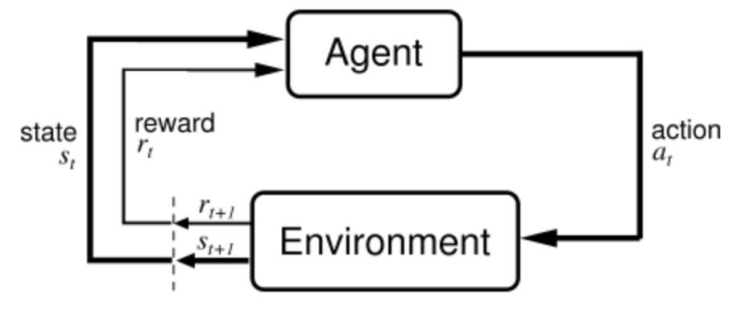
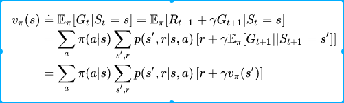
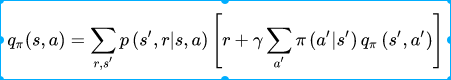

## 深度强化学习面试题目总结
1. 什么是强化学习？
> 强化学习（Reinforcement Learning, RL），又称增强学习，是机器学习的范式和方法论之一，用于描述和解决智能体（agent）在与环境的交互过程中通过学习策略以达成回报最大化或实现特定目标的问题

>
>
2. 强化学习和监督学习、无监督学习的区别是什么？
> 监督学习一般有标签信息，而且是单步决策问题，比如分类问题。监督学习的样本一般是独立
>同分布的。无监督学习没有任何标签信息，一般对应的是聚类问题。强化学习介于监督和无监督学
>习之间，每一步决策之后会有一个标量的反馈信号，即回报。通过最大化回报以获得一个最优策略。
>因此强化学习一般是多步决策，并且样本之间有强的相关性。
>
>
3. 强化学习适合解决什么样子的问题？
> 强化学习适合于解决模型未知，且当前决策会影响环境状态的（序列）决策问题。Bandit问题可以
>看成是一种特殊的强化学习问题，序列长度为1，单步决策后就完事了，所以动作不影响状态。当然也有影响
>的bandit问题，叫做contextual bandit问题。
>
>
4. 强化学习的损失函数（loss function）是什么？和深度学习的损失函数有何关系？
> 累积回报。依赖于不同的问题设定，累积回报具有不同的形式。比如对于有限长度的MDP问题直接用
>回报和作为优化目标。对于无限长的问题，为了保证求和是有意义的，需要使用折扣累积回报或者平均
>回报。深度学习的损失函数一般是多个独立同分布样本预测值和标签值的误差，需要最小化。强化学习
>的损失函数是轨迹上的累积和，需要最大化。
>
>
5. POMDP是什么？马尔科夫过程是什么？马尔科夫决策过程是什么？里面的“马尔科夫”体现了什么性质？
> POMDP是部分可观测马尔科夫决策问题。
>马尔科夫过程表示一个状态序列，每一个状态是一个随机变量，变量之间满足马尔科夫性，表示为
>一个元组<S, P>，S是状态，P表示转移概率。
>MDP表示为一个五元组<S, A, P, R, $\gamma$>，S是状态集合，A是动作集合，P表示转移概率，即模型，
>R是回报函数，$\gamma$表示折扣因子。
>马尔科夫体现了无后效性，也就是说未来的决策之和当前的状态有关，和历史状态无关。
>

6. 贝尔曼方程的具体数学表达式是什么？
> 对于状态值函数的贝尔曼方程：
>
>对于动作值函数的贝尔曼方程：
>

7. 最优值函数和最优策略为什么等价？
> 最优值函数唯一的确定了某个状态或这状态-动作对相对比他状态和状态-动作对的利好，我们可以
>依赖这个值唯一的确定当前的动作，他们是对应的，所以等价。

8. 值迭代和策略迭代的区别?
> 策略迭代。它有两个循环，一个是在策略估计的时候，为了求当前策略的值函数需要迭代很多次。
>另外一个是外面的大循环，就是策略评估，策略提升这个循环。值迭代算法则是一步到位，直接估计
>最优值函数，因此没有策略提升环节。
>参考[值迭代算法](https://zhuanlan.zhihu.com/p/55217561)
>
>
9. 如果不满足马尔科夫性怎么办？当前时刻的状态和它之前很多很多个状态都有关之间关系？
> 如果不满足马尔科夫性，强行只用当前的状态来决策，势必导致决策的片面性，得到不好的策略。
>为了解决这个问题，可以利用RNN对历史信息建模，获得包含历史信息的状态表征。表征过程可以
>使用注意力机制等手段。最后在表征状态空间求解MDP问题。

10. 求解马尔科夫决策过程都有哪些方法？有模型用什么方法？动态规划是怎么回事？
> 方法有：动态规划，时间差分，蒙特卡洛。
>有模型可以使用动态规划方法。
>动态规划是指：将一个问题拆分成几个子问题，分别求解这些子问题，然后获得原问题的解。
>贝尔曼方程中为了求解一个状态的值函数，利用了其他状态的值函数，就是这种思想（个人觉得）。
>
>
11. 简述动态规划(DP)算法？
> 不知道说的是一般的DP算法，还是为了解决MDP问题的DP算法。这里假设指的是后者。总的来说DP方法
>就是利用最优贝尔曼方程来更新值函数以求解策略的方法。最优贝尔曼方程如下：
>
>
>参考[DP算法概述](https://zhuanlan.zhihu.com/p/54763496/edit)
>
>
12. 简述蒙特卡罗估计值函数(MC)算法。
> 蒙特卡洛就死采样仿真，蒙特卡洛估计值函数就是根据采集的数据，利用值函数的定义来更新
>值函数。这里假设是基于表格的问题，步骤如下：
>
>初始化，这里为每一个状态初始化了一个 Return(s) 的列表。可以想象列表中每一个元素就是一次累积回报。
>
>根据策略pi生成轨迹tau
>
>利用轨迹，统计每个状态对应的后续累积回报，并将这个值加入对应状态的Return(s)列表
>
>重复若干次，每次都会往对应出现的状态回报列表中加入新的值。最后根据定义，每个状态回报列表中数字的均值
>就是他的值估计
>
>参考[MC值估计](https://zhuanlan.zhihu.com/p/55487868)

13. 简述时间差分(TD)算法。
> TD,MC和DP算法都使用广义策略迭代来求解策略，区别仅仅在于值函数估计的方法不同。DP使用的是贝尔曼
>方程，MC使用的是采样法，而TD方法的核心是使用自举（bootstrapping），即值函数的更新为：
>V(s_t) <-- r_t + \gamma V(s_next)，使用了下一个状态的值函数来估计当前状态的值。

14. 简述动态规划、蒙特卡洛和时间差分的对比（共同点和不同点）

15. MC和TD分别是无偏估计吗？
16. MC、TD谁的方差大，为什么？
17. 简述on-policy和off-policy的区别
18. 简述Q-Learning，写出其Q(s,a)更新公式。它是on-policy还是off-policy，为什么？
19. 写出用第n步的值函数更新当前值函数的公式（1-step，2-step，n-step的意思）。当n的取值变大时，期望和方差分别变大、变小？
20. TD（λ）方法：当λ=0时实际上与哪种方法等价，λ=1呢？
21. 写出蒙特卡洛、TD和TD（λ）这三种方法更新值函数的公式？
22. value-based和policy-based的区别是什么？
23. DQN的两个关键trick分别是什么？
24. 阐述目标网络和experience replay的作用？
25. 手工推导策略梯度过程？
26. 描述随机策略和确定性策略的特点？
27. 不打破数据相关性，神经网络的训练效果为什么就不好？
28. 画出DQN玩Flappy Bird的流程图。在这个游戏中，状态是什么，状态是怎么转移的？奖赏函数如何设计，有没有奖赏延迟问题？
29. DQN都有哪些变种？引入状态奖励的是哪种？
30. 简述double DQN原理？
31. 策略梯度方法中基线baseline如何确定？
32. 画出DDPG框架结构图？
33. Actor-Critic两者的区别是什么？
34. actor-critic框架中的critic起了什么作用？
35. DDPG是on-policy还是off-policy，为什么？
36. 是否了解过D4PG算法？简述其过程
37. 简述A3C算法？A3C是on-policy还是off-policy，为什么？
38. A3C算法是如何异步更新的？是否能够阐述GA3C和A3C的区别？
39. 简述A3C的优势函数？
40. 什么是重要性采样？
41. 为什么TRPO能保证新策略的回报函数单调不减？
42. TRPO是如何通过优化方法使每个局部点找到让损失函数非增的最优步长来解决学习率的问题；
43. 如何理解利用平均KL散度代替最大KL散度？
44. 简述PPO算法？与TRPO算法有何关系？
45. 简述DPPO和PPO的关系？
46. 强化学习如何用在推荐系统中？
47. 推荐场景中奖赏函数如何设计？
48. 场景中状态是什么，当前状态怎么转移到下一状态？
49. 自动驾驶和机器人的场景如何建模成强化学习问题？MDP各元素对应真实场景中的哪些变量？
50. 强化学习需要大量数据，如何生成或采集到这些数据？
51. 是否用某种DRL算法玩过Torcs游戏？具体怎么解决？
52. 是否了解过奖励函数的设置(reward shaping)？

### 贡献致谢列表
@名字(仓库地址), ......

#### 参考及引用链接：

[1]https://zhuanlan.zhihu.com/p/33133828 
[2]https://aemah.github.io/2018/11/07/RL_interview/
