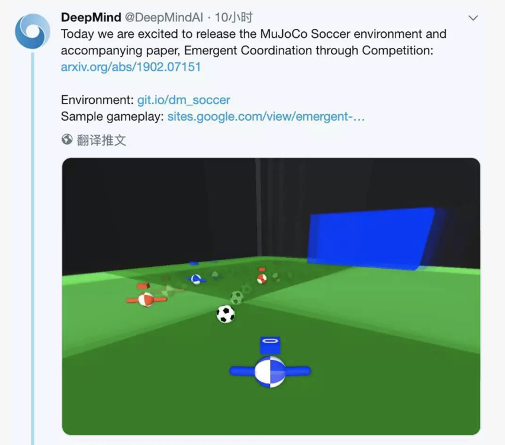
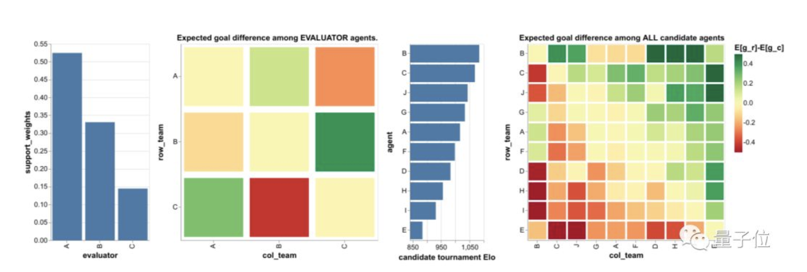

深度强化学习以及最近科技大事件实时展示！[时间线从近到远]

**最近即将发生的【最新追踪中-----敬请期待】**

---
### **2019.8.28**
**DeepMind开源OpenSpiel平台**(https://github.com/deepmind/open_spiel)


什么是 OpenSpiel
OpenSpiel 是一个综合性的强化学习游戏测试平台，包括了多种游戏环境和算法，用于强化学习研究或搜索策略的研究。可以帮助研究者解决很多强化学习研究中需要设置实验的问题，它支持：
+ 单人或多人博弈；
+ 完美信息或不完美信息博弈；
+ 带有随机性的博弈；
+ 普通的多玩家「一步」或二人玩家的多步博弈；
+ 交替行动（如下棋）或同时行动的游戏；
+ 零和博弈和非零和博弈（如需要合作的博弈等）。

目前，OpenSpiel平台支持多种编程语言：
+ C++11
+ Python 3

目前 OpenSpiel 已经在 Linux 系统上进行了测试（Debian 10 和 Ubuntu 19.04），但是没有在 MacOS 或 Windows 上测试过。但是因为后两个平台都可以自由使用代码，因此作者认为不太可能出现大的问题。

**OpenSpiel 目前支持以下游戏，共 25 款，包括国际象棋、围棋、双陆棋、翻转棋等游戏**：


OpenSpiel 怎么用
首先，我们先要明确，在 OpenSpiel 中 Game 对象包含了对某个游戏非常高层次的描述，例如游戏的方式、参与人数、最大分数等。而 State 对象描述了更加具体的游戏局，例如象棋中特定的棋子状态、扑克中特定的手牌组合。通过这两个对象，整个游戏都是通过树来表示的。

OpenSpiel 首先需要加载游戏，配置游戏进行方式，然后就可以直接运行了。如下所示为玩 trajectory 游戏的 Python 代码：
```python
import randomimport pyspielgame = pyspiel.load_game("kuhn_poker")

state = game.new_initial_state()
while not state.is_terminal():
   legal_actions = state.legal_actions()
   if state.is_chance_node():
     # Sample a chance event outcome.
     outcomes_with_probs = state.chance_outcomes()
     action_list, prob_list = zip(*outcomes_with_probs)
     action = np.random.choice(action_list, p=prob_list)    state.apply_action(action)
   else:
     # The algorithm can pick an action based on an observation (fully observable  # games) or an information state (information available for that player)
     # We arbitrarily select the first available action as an example.
     action = legal_actions[0]
     state.apply_action(action)复制代码
```


---
### **2019.2.22**


英国的AI公司DeepMind开源了机器人足球模拟环境MuJoCo Soccer，实现了对2v2足球赛的模拟。虽然球员的样子比较简单（也是个球），但DeepMind让它们在强化学习中找到了团队精神。热爱足球游戏的网友仿佛嗅到了它前景：你们应该去找EA合作FIFA游戏！

让AI学会与队友配合
与AlphaGo类似，DeepMind也训练了许多“Player”。DeepMind从中选择10个双人足球团队，它们分别由不同训练计划制作而成的。

这10个团队每个都有250亿帧的学习经验，DeepMind收集了它们之间的100万场比赛。让我们分别从俯瞰视角来看一下其中一场2V2的足球比赛吧：


DeepMind发现，随着学习量的增加，“球员”逐渐从“独行侠”变成了有团队协作精神的个体。一开始蓝色0号队员总是自己带球，无论队友的站位如何。在经历800亿画面的训练后，它已经学会积极寻找传球配合的机会，这种配合还会受到队友站位的影响。其中一场比赛中，我们甚至能看到到队友之间两次连续的传球，也就是在人类足球比赛中经常出现的2过1传球配合。

球队相生相克
除了个体技能外，DeepMind的实验结果还得到了足球世界中的战术相克。实验中选出的10个智能体中，B是最强的，Elo评分为1084.27；其次是C，Elo评分为1068.85；A的评分1016.48在其中仅排第五。


为何选择足球游戏
去年DeepMind开源了强化学习套件DeepMind Control Suite，让它模拟机器人、机械臂，实现对物理世界的操控。而足球是一个很好的训练多智能体的强化学习环境，比如传球、拦截、进球都可以作为奖励机制。同时对足球世界的模拟也需要物理引擎的帮助。DeepMind希望研究人员通过在这种多智能体环境中进行模拟物理实验, 在团队合作游戏领域内取得进一步进展。于是他们很自然地把2v2足球比赛引入了DeepMind Control Suite，让智能体的行为从自发随机到简单的追球，最后学会与队友之间进行团队配合。

**DIY试玩方法**
现在你也可以自己去模拟这个足球游戏。首先安装MuJoCo Pro 2.00和dm_control，还需要在运行程序中导入soccer文件，然后就可以开始尝试了。

```python

from dm_control.locomotion import soccer as dm_soccer

# Load the 2-vs-2 soccer environment with episodes of 10 seconds:
env = dm_soccer.load(team_size=2, time_limit=10.)

# Retrieves action_specs for all 4 players.
action_specs = env.action_spec()

# Step through the environment for one episode with random actions.
time_step = env.reset()
while not time_step.last():
  actions = []
  for action_spec in action_specs:
    action = np.random.uniform(
        action_spec.minimum, action_spec.maximum, size=action_spec.shape)
    actions.append(action)
  time_step = env.step(actions)

  for i in range(len(action_specs)):
    print(
        "Player {}: reward = {}, discount = {}, observations = {}.".format(
            i, time_step.reward[i], time_step.discount,
            time_step.observation[i]))
```
在运行代码中，你还可以修改队伍人数和游戏时长，如果改成11v11、90分钟，就变成了一场FIFA模拟赛（滑稽）。

[Github源码链接](https://github.com/deepmind/dm_control/tree/master/dm_control/locomotion/soccer)

---

### 2019.1.21

DeepMind联合牛津提出注意力神经过程<br>
1月21日消息，来自DeepMind和牛津大学的研究者认为，神经过程（NP）存在着一个根本的不足——欠拟合，对其所依据的观测数据的输入给出了不准确的预测。他们通过将注意力纳入NP来解决这个问题，允许每个输入位置关注预测的相关上下文点。研究表明，这大大提高了预测的准确性，显著加快了训练速度，并扩大了可以建模的函数范围。

----
