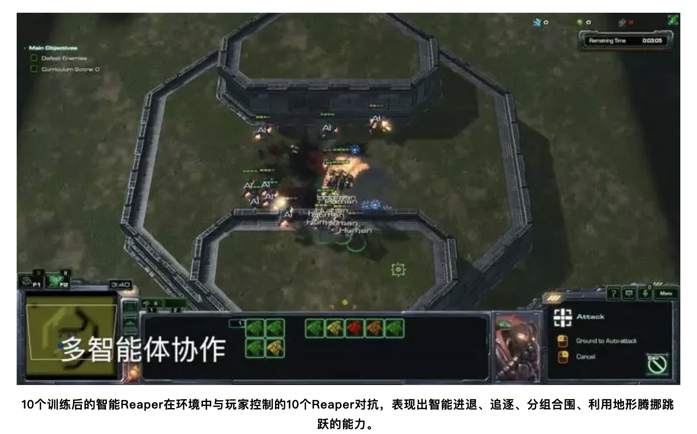

# 启元世界

公司官网： http://www.inspirai.com
公司地址：北京市海淀区后屯路28号院KPHZ国际技术转移中心4层428室

### 关于启元(inspir-ai)：
启元世界是一家 2017 年成立的以认知决策智能技术为核心的公司，由前阿里、Netflix、IBM 的科学家和高管发起，多位名牌大学的博士和硕士加入，并拥有伯克利、CMU 等知名机构的特聘顾问。启元世界的愿景是「打造决策智能、构建平行世界、激发人类潜能」，团队核心能力以深度学习、强化学习、超大规模并行计算为基础，拥有互联网、游戏等众多领域的成功经验，受到国内外一流投资人的青睐。

### 创始人：
袁泉，启元世界创始人 & CEO：曾担任阿里认知计算实验室负责人、资深总监，手机淘宝天猫推荐算法团队缔造者，打造了有好货、猜你喜欢等电商知名个性化产品，率团队荣获 2015 年双 11 CEO 特别贡献奖。加入阿里前，袁泉曾是 IBM 中国研究院的研究员，从事推荐等智能决策算法的研究，是 IBM 2011 年全球银行业 FOAK 创新项目发起人。在工业界大规模应用实践的同时，总结并发表了十余篇论文在国际顶级会议 ACM RecSys、KDD、SDM 等。袁泉拥有多项中美技术专利，长期担任 ACM RecSys、IEEE Transaction on Games 审稿人。

### 人才招聘

招聘对象
面向人群：海内外院校2019&2020届毕业生
毕业时间：2019年6月—2020年10月

#### 招聘职位
**1、强化学习算法研究员**
职位描述:
◆ 负责深度强化学习的前沿算法研究，推动和保持公司在国内外业界的技术领先性
◆以发表国际一流顶级会议文章，或设计优化算法原型系统为目标
职位要求:
◆机器学习、统计、数学、计算机科学、博弈论相关专业博士，或优秀硕士
◆在NIPS/ICML/ICLR/IROS／ACL／CVPR等著名国际会议或者顶级期刊上有论文发表经验
◆强化学习、深度学习理论和实践基础扎实；熟练使用Python/C++至少一门语言
工作地：北京/杭州

**2、强化学习算法工程师**
职位描述：
◆ 负责深度强化学习算法的实现和优化
◆ 以参加某一国际相关竞赛，或完成某一前沿任务研发为目标
职位要求:
◆计算机、数学、自动化、统计、机器学习等相关专业，大学本科及以上学历
◆较强的算法设计和实现能力，在Kaggle、天池、ACM ICPC等国内外竞赛中获奖者优先
◆能够熟练的使用Python编程，有C++编程经验者优先
◆熟练使用TensorFlow、Ray、Caffe2等机器学习工具，熟悉底层实现为宜
工作地：北京/杭州

**3、强化学习平台研发工程师**
职位描述：
◆ 参与公司机器学习平台的架构设计、实现和优化工作
职位要求:
◆ 计算机相关专业本科及以上学历
◆ 熟练应用C/C++、Python等语言，具有良好的编程习惯，熟悉多线程编程，内存管理，设计模式和Linux/Unix开发环境
◆ 掌握分布式系统相关知识，或熟悉GPU硬件架构和CUDA编程，有大规模／互联网系统开发经验者优先
◆ 良好的沟通能力，有责任心，自我驱动
工作地：北京/杭州

**4、强化学习机器人工程师**
职位描述：
◆ 基于机器学习的方法进行机器人控制及路径规划，解决机器人在实际应用场景的迁移性、鲁棒性等问题，不断优化提升效果。
职位要求：
◆ 机器人、计算机、自动化、自控、机械等相关专业本科及以上学历；
◆ 熟悉机器人系统结构和ROS等软件栈，能够熟练使用C++、Python等任一编程语言；
◆ 具备较强的动手能力，在国内外各类机器人竞赛中获奖者优先；
◆ 具有实际 SLAM、定位算法、图像视觉处理等经验者优先；有机器人相关项目经验者优先
工作地：北京/杭州
投递方式

___

*投递简历至公司邮箱: hr@inspirai.com*

**时间节点**
1： 投递简历至公司邮箱
>3月15日 ——4月22日
欢迎访问官网inspirai.com
投递简历至 hr@inspirai.com

2：在线答题和面试
>3月22日——5月1日
通常有3轮面试，请留意邮箱或电话通知

3：发放offer
>资深博士／专家成为实习mentor，开启强化学习的难忘旅程
