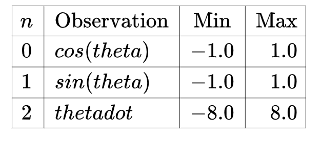

### Pendulum-v0环境奖励奖励函数
环境地址：https://gym.openai.com/envs/Pendulum-v0/

### 1. 概述
倒立摆问题是控制文献中的经典问题。 在这个版本的问题中，钟摆以随机位置开始，目标是将其向上摆动，使其保持直立。
类型：连续控制
### 2. 环境
#### 2.1  Observation & state

#### 2.2 Actions

#### 2.3 Reward（重点）

奖励的精确等式：


实质上，目标是保持零角度（垂直），旋转速度最小，力度最小。
#### 2.4 初始状态
从和的随机角度，以及-1和1之间的随机速度
#### 2.5 终止状态- Episode Termination
没有指定的终止状态。 添加最大步数可能是个好主意。
#### 2.6  Solved Requirements
目前尚未指定
### 3. 代码
#### 3.1 导入lib
```python
import gym
from gym import spaces
from gym.utils import seeding
import numpy as np
from os import path
```

#### 3.2 定义PendulumEnv(gym.Env)类：
```python
class PendulumEnv(gym.Env):
    metadata = {
        'render.modes' : ['human', 'rgb_array'],
        'video.frames_per_second' : 30
    }
```

##### 3.2.1 定义 __init__(self)函数:
```python
def __init__(self):
    self.max_speed=8   # 最大角速度：theta dot
    self.max_torque=2. # 最大力矩
    self.dt=.05 采样时间
    self.viewer = None

    high = np.array([1., 1., self.max_speed]) # 这里的前两项是 cos 和 sin 值
    self.action_space = spaces.Box(low=-self.max_torque, high=self.max_torque, shape=(1,), dtype=np.float32)
        self.observation_space = spaces.Box(low=-high, high=high, dtype=np.float32)
        # 动作空间： (-2, 2)
        # 观察空间： ([-1,-1,-8],[1,1,8])

    self.seed()
```

##### 3.2.2 定义随机种子函数seed()
```python
    def seed(self, seed=None):
        self.np_random, seed = seeding.np_random(seed)
        return [seed]
```

##### 3.2.3 定义step()函数

```python
    def step(self,u): # u 是 action
        th, thdot = self.state # th := theta

        g = 10. # 重力加速度
        m = 1.  # 质量
        l = 1.  # 长度
        dt = self.dt # 采样时间

        u = np.clip(u, -self.max_torque, self.max_torque)[0]
        # np.clip(u,-2,2): u是一个一维数组(虽然只有一个元素)
        # 此元素若小于-2， 则将-2赋给此元素，若大于 2，则将2赋给此元素，
        # 若是在中间，则不变，作用是将动作值限定在[-2,2]之间
        self.last_u = u # for rendering
        costs = angle_normalize(th)**2 + .1*thdot**2 + .001*(u**2)

        newthdot = thdot + (-3*g/(2*l) * np.sin(th + np.pi) + 3./(m*l**2)*u) * dt
        newth = th + newthdot*dt
        newthdot = np.clip(newthdot, -self.max_speed, self.max_speed) #pylint: disable=E1111

        self.state = np.array([newth, newthdot])
        return self._get_obs(), -costs, False, {}
```


> 代价函数：costs包含三项，
一是，
二是，
三是。
第一项我们后面分析；第二项表示对于角速度的惩罚，在到达目标位置（竖直）之后，如果还有较大的速度的话，就越过去了；第三项是对于输入力矩的惩罚，使用的力矩越大，惩罚越大，毕竟力矩×角速度=功率，还是小点的好。
使用前向欧拉方法计算新的角速度(newthdot)
同样方法计算新的角度(newth)
将角速度值限定在[-8,8]之间
执行动作之后得到的新状态
step()函数返回下一时刻的观测，回报，是否终止,调试项,这里面有一个函数self_get_obs() 在下面定义的，这个函数就指明了Observation是state的函数这一点。

#####  3.2.4 定义reset()函数

在强化学习算法中，智能体需要一次次地尝试，累积经验，然后从经验中学到好的动作。一次尝试我们称之为一条轨迹或一个episode. 每次尝试都要到达终止状态. 一次尝试结束后，智能体需要从头开始，这就需要智能体具有重新初始化的功能。函数reset()就是这个作用, agent与环境交互前调用该函数，确定agent的初始状态以及其他可能的一些初始化设置。此例中在每个episode开始时，th初始化为[-pi,pi]之间的一个任意角度，速度初始化为[-1,1]之间的一个任意值.

```python
    def reset(self):
        high = np.array([np.pi, 1])
        self.state = self.np_random.uniform(low=-high, high=high)
        self.last_u = None
        return self._get_obs()
```

##### 3.2.5  定义_get_obs()函数
```python
    def _get_obs(self):
        theta, thetadot = self.state
        return np.array([np.cos(theta), np.sin(theta), thetadot])
```

##### 3.2.6 定义render()函数
```python
    def render(self, mode='human'):

        if self.viewer is None:
            from gym.envs.classic_control import rendering
            self.viewer = rendering.Viewer(500,500)
            self.viewer.set_bounds(-2.2,2.2,-2.2,2.2)
            rod = rendering.make_capsule(1, .2)
            rod.set_color(.8, .3, .3)
            self.pole_transform = rendering.Transform()
            rod.add_attr(self.pole_transform)
            self.viewer.add_geom(rod)
            axle = rendering.make_circle(.05)
            axle.set_color(0,0,0)
            self.viewer.add_geom(axle)
            fname = path.join(path.dirname(__file__), "assets/clockwise.png")
            self.img = rendering.Image(fname, 1., 1.)
            self.imgtrans = rendering.Transform()
            self.img.add_attr(self.imgtrans)

        self.viewer.add_onetime(self.img)
        self.pole_transform.set_rotation(self.state[0] + np.pi/2)
        if self.last_u:
            self.imgtrans.scale = (-self.last_u/2, np.abs(self.last_u)/2)

        return self.viewer.render(return_rgb_array = mode=='rgb_array')

```

##### 3.2.7 定义close()函数
```python
    def close(self):
        if self.viewer:
            self.viewer.close()
            self.viewer = None
```

##### 3.2.8 定义angle_normalize()函数
```python
def angle_normalize(x):
    return (((x+np.pi) % (2*np.pi)) - np.pi)
```
(原理重点)先对(x+pi)%(2*pi)-pi进行分析，带入几个角度，比如x=pi/4，return=pi/4；x=3*pi/4，return=3*pi/4；x=5*pi/4，return=-3*pi/4。这样我们就可以绘图如下[4]：


参考文献：
https://www.jianshu.com/p/af3a7853268f
