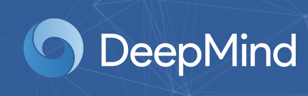
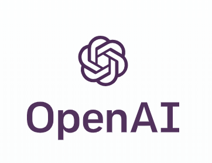
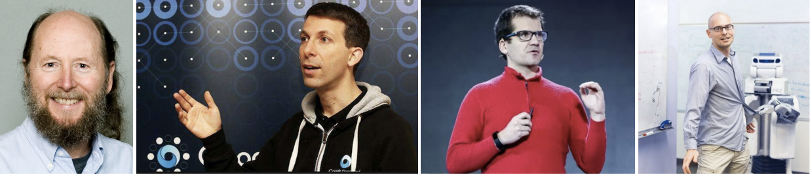

# Deep Reinforcement Learning(深度强化学习)

本仓库致力于“四个帮助”，
>
+ 【1】提供最全面的深度强化学习书籍、资料、综述等学习资源。
+ 【2】阐述深度强化学习的基本原理、前沿算法、场景应用、竞赛分析、论文分享等专业知识。
+ 【3】分享最前沿的业界动态和行业发展趋势。
+ 【4】汇聚所有深度强化学习领域的研究者与爱好者。

### 背景
如今机器学习发展如此迅猛，各类算法层出不群，特别是深度神经网络在计算机视觉、自然语言处理、时间序列预测等多个领域更是战果累累，可以说这波浪潮带动了很多人进入深度学习领域，也成就了其一番事业。而强化学习作为一门灵感来源于心理学中的行为主义理论的学科，其内容涉及概率论、统计学、逼近论、凸分析、计算复杂性理论、运筹学等多学科知识，难度之大，门槛之高，导致其发展速度特别缓慢。围棋作为人类的娱乐游戏中复杂度最高的一个，它横竖各有19条线，共有361个落子点，双方交替落子，状态空间高达10的171次方(注：宇宙中的原子总数是10的80次方，即使穷尽整个宇宙的物质也不能存下围棋的所有可能性）
### 1、什么是深度强化学习？

>
+ 2015年10月，由Google DeepMind公司开发的AlphaGo程序击败了人类高级选手樊麾，成为第一个无需让子即可在19路棋盘上击败围棋职业棋手的计算机围棋程序，并写进了历史，论文发表在国际顶级期刊《Science》上。
+ 2016年3月，透过自我对弈数以万计盘进行练习强化，AlphaGo在一场五番棋比赛中4:1击败顶尖职业棋手李世石。
+ Master(AlphaGo版本)于2016年12月开始出现于弈城围棋网和腾讯野狐围棋网，取得60连胜的成绩，以其空前的实力轰动了围棋界。
+ DeepMind 如约公布了他们最新版AlphaGo论文(Nature)，介绍了迄今最强最新的版本AlphaGo Zero，使用纯强化学习，将价值网络和策略网络整合为一个架构，3天训练后就以100比0击败了上一版本的AlphaGo。AlphaGo已经退休，但技术永存。DeepMind已经完成围棋上的概念证明，接下来就是用强化学习创造改变世界的价值。

围棋被攻克证明了强化学习发展的威力，作为AlphoGo的带头人，强化学习界的大神，David Sliver及其团队可以说盛名远扬，其以前沿的目光发表了人工智能的终极目标是：

AI = DL(Deep Learning) + RL(Reinforcement Learning) == DRL(Deep Reinforcement Learning)

---

### 2、深度强化学习有哪些应用？
在深度学习已经取得了很大的进步的基础上，深度强化学习真正的发展归功于神经网络、深度学习以及计算力的提升，David就是使用了神经网络逼近值函数后，开启了一门新的研究方向：深度强化学习（Deep Reinforcement Learning，DRL），又一发不可收拾的证明了确定性策略等。纵观近四年的ICML，NPIS等顶级会议论文，强化学习的理论进步，应用领域逐渐爆发式增广，目前已经在如下领域有了广泛使用:
>
+ 自动驾驶：自动驾驶载具（self-driving vehicle）
+ 控制论(离散和连续大动作空间): 玩具直升机、Gymm_cotrol物理部件控制、机器人行走、机械臂控制。
+ 游戏：Go, Atari 2600(DeepMind论文详解)等
+ 自然语言处理：机器翻译, 文本序列预测，问答系统，人机对话
+ 超参数学习：神经网络参数自动设计
+ 推荐系统：阿里巴巴黄皮书（商品推荐），广告投放。
+ 智能电网：电网负荷调试，调度等
+ 通信网络：动态路由, 流量分配等
+ 财务与财经系统分析与管理
+ 智能医疗
+ 智能交通网络及网络流
+ 物理化学实验：定量实验，核素碰撞，粒子束流调试等
+ 程序学习和网络安全：网络攻防等

---

### 3、一流研究机构有哪些?
#### DeepMind [直接访问](https://deepmind.com/)

DeepMind是一家英国的人工智能公司。公司创建于2010年，最初名称是DeepMind科技（DeepMind Technologies Limited），在2014年被谷歌收购。

>
+ DeepMind于2014年开始开发人工智能围棋软件AlphaGo。
+ 2015年10月，分布式版AlphaGo分先以5:0击败了欧洲围棋冠军华裔法籍职业棋士樊麾二段[23][24][25] 。这是计算机围棋程序第一次在十九路棋盘且分先的情况下击败职业围棋棋手[26]。
+ 2016年3月，AlphaGo挑战世界冠军韩国职业棋士李世乭（이세돌）九段，对弈结果为AlphaGo 4:1战胜了李世乭。
+ 2016年12月29日，一个注册名为Magister（大陆客户端显示为Magist）的账号开始在弈城围棋网与职业棋手对弈，次日用户名改为Master。12月31日获取30连胜后，2017年1月1日Master转往腾讯野狐围棋网对弈，最终Master在野狐也获取30连胜，总成绩为60场不败[27]，在60局结束后，DeepMind CEO杰米斯·哈萨比斯声明确认Master就是升级版AlphaGo[28][29]。
+ 2017年10月19日，AlphaGo的团队在《自然》杂志上发表了一篇文章，介绍了AlphaGo Zero，这是一个没有用到人类数据的版本，比以前任何击败人类的版本都要强大。[30] 通过跟自己对战，AlphaGo Zero经过3天的学习，以100:0的成绩超越了AlphaGo Lee的实力，21天后达到了AlphaGo Master的水平，并在40天内超过了所有之前的版本。[31]
+ 2018年12月7日，DeepMind在《科学》期刊上发表关于AlphaZero的论文，AlphaZero使用与AlphaGo Zero类似但更一般性的算法，在不做太多改变的前提下，并将算法从围棋延伸到将棋与国际象棋上。
+ 2019年1月25日，DeepMind人工智能AlphaStar在《星海争霸II》以10：1战胜人类职业玩家。[32]

#### OpenAI [直接访问](https://openai.com/)

OpenAI是一个非营利性人工智能（AI）研究组织，旨在促进和发展友好的人工智能，使人类整体受益。这家总部位于旧金山的组织成立于2015年底，旨在通过向公众开放其专利和研究，与其他机构和研究人员“自由合作”。创始人（尤其是伊隆马斯克和萨姆奥特曼）的部分动机是出于对通用人工智能风险的担忧。

>
+ 2015年10月，马斯克，奥特曼和其他投资者宣布成立该组织，承诺向该合资企业提供超过10亿美元的资金。
+ 2016年4月27日，OpenAI发布了一个公共测试版“OpenAI Gym”，它是强化学习研究的平台。
+ 2016年12月5日，OpenAI发布了Universe，这是一个软件平台，用于测量和训练AI在全球游戏，网站和其他应用程序中的一般情报。2018年2月21日，马斯克辞去了他的董事会席位，称“与特斯拉AI开发自驾车有潜在的未来冲突（感兴趣）” ，但仍然是捐赠者。
+ 2018年，OpenAI总部位于旧金山的Mission区，与Musk共同创办的另一家公司Neuralink共享一座办公楼。
#### UC Berkeley [直接访问]()

---

### 4、业界大佬有哪些？

顺序从左往右：
>
+ （1）Richard Sutton[个人主页](http://incompleteideas.net/) 
强化学习的祖师爷，著有《Reinforcement Learning: An Introduction》

+ （2）David Sliver[DeepMind] 
AlphaGo、AlphaStar掌门人，UCL公开课主讲人

+ （3）Oriol Vinyals[DeepMind] 
AlphaStar主要负责人

+ （4）Pieter Abbeel[UC Berkeley] 
机器人和强化学习专家

---

### 5、怎么学习深度强化学习
[点击进入【基础与课程学习】主页](https://github.com/NeuronDance/DeepRL/tree/master/DRL%E5%9F%BA%E7%A1%80%E5%8E%9F%E7%90%86) 
[点击进入【组队竞赛学习】主页](https://github.com/NeuronDance/DeepRL/tree/master/DRL%E7%AB%9E%E8%B5%9B) 
[点击进入【前沿算法学习】主页](https://github.com/NeuronDance/DeepRL/tree/master/DRL%E5%89%8D%E6%B2%BF%E7%AE%97%E6%B3%95)
### 6、最新前沿动态

#### 进展： 【2019.2.22】
英国AI公司DeepMind开源了机器人足球模拟环境MuJoCo Soccer，实现了对2v2足球赛的模拟。虽然球员的样子比较简单（也是个球），但DeepMind让它们在强化学习中找到了团队精神。热爱足球游戏的网友仿佛嗅到了它前景：你们应该去找EA合作FIFA游戏！详情查看更多链接！ 
[查看更多最新大事件](https://github.com/NeuronDance/DeepRL/tree/master/DRL%E6%9C%80%E8%BF%91%E5%A4%A7%E4%BA%8B%E4%BB%B6)

---
### @致谢
为了表示对每一位贡献者的感谢，本栏目将贡献者一一列举，排名不分先后：

**发起人**：J.Q.Wang 

**贡献者**：格式为：@GitHub账户名（名字） 

@taoyafan([陶亚凡](https://github.com/taoyafan)),@BluesChang([Name](https://github.com/BluesChang))

---

#### 联系我们
#### 交流方式
[1]、Google[网上论坛](https://groups.google.com/forum/?hl=zh-CN#!forum/deeprl)[需科学上网] 
[2]、微信群聊：加微信助手：NeuronDance，邀请进群 
[3]、QQ群：617458178

#### 联系方式
E-mail：wjq_z@qq.com 
CSDN博客：[深度强化学习(DRL)探索](https://blog.csdn.net/gsww404) 
知乎专栏：[DeepRL探索](https://zhuanlan.zhihu.com/deeprl), [DRL论文解读](https://zhuanlan.zhihu.com/drl-paper), [DRL学习](https://zhuanlan.zhihu.com/drl-learning) 
微信公众号：

